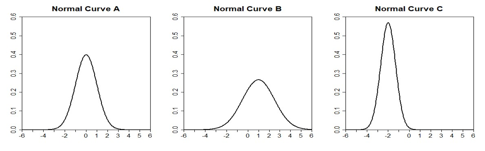

# (PART) **Week** 4 {-}

# Module 12 {-} 

&nbsp;

## Probability {-}


Probability theory is the foundation of statistics, and R has plenty of machinery for working with probability, probability distributions, and random variables. The recipes in this module show you how to calculate probabilities from quantiles, calculate quantiles from probabilities, generate random variables drawn from distributions, plot distributions, and so forth.

When working with different statistical distributions, we often want to make probabilistic statements based on the distribution. We typically want to know one of four things:


* The value of the **probability density function (pdf)** at a particular point
* The value of the **cumulative distribution function (cdf)** at a particular point
* The **quantile value** corresponding to a particular probability
* A **random draw** of values from a particular distribution


R has functions for obtaining density, distribution, quantile and random values. The general naming structure of the relevant R functions is:

* `dname` calculates pdf at input `x`
* `pname` calculates cdf at input `x`
* `qname` calculates the quantile at an input probability
* `rname` generates a random draw from a particular distribution

Note than `name` in the functions above represents the name of the given distribution. In statistics, there are many well-known and commonly used probability distributions that can be divided into two groups: **discrete** and **continuous** distributions.


Discrete distributions are those whose possible values either constitute a finite set or else can be listed in an infinite sequence in which there is a first element, a second element, and so on ("countably" infinite). In contrast, continuous distributions are those whose possible values consist either of all numbers in a single interval on the number line or all numbers in a disjoint union of such intervals. 

R has functions for almost all well-studied and commonly used distributions. The tables below list some of them:


Discrete Distribution | R Function | Parameters
----------------------|------------|-----------
Binomial | `*binom` | `n` - number of trials; `p` - probability of success for one trial
Geometric | `*geom` | `p` - probability of success for one trial
Poisson | `*pois` | `lambda` - a mean value of the distribution


Continuous Distribution | R Function | Parameters
----------------------|------------|-----------
Normal | `*norm` | `mean` - mean value of the distribution, `sd` - standard deviation
Uniform | `*unif` | `min` - lower limit, `max` - upper limit
Student's _t_ | `*t` | `df` - degrees of freedom
Chi-squared | `*chisq` | `df` - degrees of freedom
Exponential | `*exp` | `rate` 

where `*` can be `d`, `p`, `q`, and `r`.

In this module we will discuss binomial, geometric, and normal distributions (these basic (but fundamental) distributions have been chosen for simplicity, in order to illustrate how the R functions work; later these functions can be generalized to other, more complex distributions). Let's dive into it.


## Bernoulli Trials {-}

Before introducing a binomial distribution, we need to discuss **Bernoulli random variables** (also known as **Bernoulli trials**). Any random variable whose only possible values are 0 (failure) and 1 (success) is called a Bernoulli random variable. 


Suppose _X_ is a Bernoulli random variable. Then,


x | 0 | 1
--| --- | ----
p(x) | 1 - _p_ | _p_


## Binomial Distribution {-}

There are many experiments that conform either exactly or approximately to the following list of requirements:

* The experiment consists of a sequence of **n** smaller experiments called _trials_, where **n** is fixed in advance of the experiment
* Each trial can result in one of the same two possible outcomes, **success (S)** and **failure (F)**.
* The trials are **independent**, so that the outcome on any particular trial does not influence the outcome on any other trial.
* The probability of success **_P(S)_** is constant from trial to trial; we denote this probability **_p_**.


An experiment for which these 4 conditions are satisfied is called a **binomial experiment**. A distribution that describes this process is called a **Binomial Distribution**. It counts the number of successes among the _n_ trials. 


A **probability mass function (pmf)** (this is the same as pdf but for discrete distributions) for a binomial distribution is given by

\begin{align*}
b(x; n, p) = \binom{n}{x} p^x(1-p)^{n-x} \quad for \quad x = 0, 1, ..., n
\end{align*}


where $\binom{n}{x} = \frac{n!}{(n-x)!x!}$ and $n! = 1 \times 2 \times ... \times n$.

In other words, the above probability mass function calculates the probability that a binomial distribution will take a particular value _x_.

Let's consider the following example:

Suppose the probability that your train is on time on any given day is 0.7. Next week, Monday through Friday, you have important meetings with your business partners every day. If your train is late, you will miss an important meeting on that particular day. Assume train schedules are independent of one another. 


Now let's count the number of days your train was on time. The possible values are **0, 1, 2, 3, 4, and 5**. As you can already guess, this is a binomial distribution with **n = 5** and **p = 0.7**. 


### dbinom() Function {-}

We can use the probability mass function to calculate probabilities of certain events. For example, what is the probability that you will attend 3 meetings only, that is, _x = 3_ ?


To answer this question, we will use `dbinom()` function:

```{r}

dbinom(x = 3, size = 5, prob = 0.7)

```

We can do this manually as well using a definition of the pmf of a binomial distribution:

```{r}

choose(n = 5, k = 3)*(0.7^3)*(0.3^2)

```


### pbinom() Function {-}

Now, suppose you want to calculate the probability that you will attend at most 4 meetings, that is, either 0, 1, 2, 3, or 4. To do so, we will need a **cumulative distribution function (cdf)** of a binomial distribution. You can use `pbinom()` function to calculate cumulative probabilities:

```{r}

pbinom(q = 4, size = 5, prob = 0.7)

```

As you noticed, `pbinom()` function is a summation of `dbinom()` functions:

```{r}

dbinom(x = 0, size = 5, prob = 0.7) +
dbinom(x = 1, size = 5, prob = 0.7) + 
dbinom(x = 2, size = 5, prob = 0.7) + 
dbinom(x = 3, size = 5, prob = 0.7) + 
dbinom(x = 4, size = 5, prob = 0.7)

```


## Geometric Distribution {-}

A **Geometric Distribution** has only one parameter **_p_** (probability of success) and describes the number of Bernoulli trials needed to get the first success. The probability mass function of a geometric distribution can be defined as follows: 


\begin{align*}
g(x; p) = (1-p)^{x-1}p \quad for \quad x = 1, 2, 3,  ...
\end{align*}


Here is an example that describes a geometric distribution: starting at a fixed time, we observe the gender of each newborn child at a certain hospital until a girl (_G_) is born. Let _P(G) = p = 0.55_ and assume that successive births are independent. 


### dgeom() Function {-}

`dgeom()` function calculates the probability that a geometric distribution will take a particular value _x_. For instance, let's calculate the probability that we need to observe 6 newborn children to get the first girl:


```{r}

dgeom(x = 6, prob = 0.55)

```


### pgeom() Function {-}

Like `pbinom()` function, `pgeom()` calculates cumulative probabilities (cdf's). For example, what is the probability that we need to observe at most 5 newborn children to get the first girl? In other words, what is the probability that our geometric distribution will take either 1, 2, 3, 4, or 5 values?


```{r}

pgeom(q = 5, prob = 0.55)

```


## Normal Distribution {-}

A **Normal Distribution** is the most important and commonly used distribution in all of probability and statistics. Many numerical populations have distributions that can be fit very closely by an appropriate normal curve. Normal distributions have two parameters: mean, $\mu$, and standard deviation, $\sigma$. Their **probability density functions (pdf's)** are defined as 

\begin{align*}
f(x; \mu, \sigma) = \frac{1}{\sqrt{2\pi}\sigma} e^{\frac{-(x - \mu)^2}{2\sigma^2}}   \quad  -\infty < x < \infty
\end{align*}

A normal distribution is bell-shaped, symmetric, and is centered at its mean value. The distribution continues to positive and negative infinity, but most of the area is close to the center. 

Normal distributions can look quite different. Specifically, a normal distribution can be adjusted using its mean and standard deviation. Changing the mean value of a normal distribution shifts the curve to the left or right. Changing the standard deviation of a normal distribution stretches or constricts the curve around the mean. Below are some examples of a normal distribution: 




### dnorm() Function  {-}

`dnorm()` calculates the value of the probability density function (pdf) of a normal distribution at a particular point `x`. In other words, it calculates the height of the normal curve at a certain point `x`. Suppose we have a normal distribution with a mean value 2.5 and standard deviation 0.5. Then, 


```{r}

x <- seq(-10, 10, by = .1)


y <- dnorm(x, mean = 2.5, sd = 0.5)


plot(x,y)

```


### pnorm() Function {-}

To calculate the value of the cumulative distribution function (cdf) at a certain value `x`, that is, the probability that a normal distribution will take values less than `x`, use `pnorm()` function. Suppose, we have a normal distribution with mean = 2 and standard deviation = 5. Now let's calculate the probability that a randomly selected observation from this distribution will be less than 3:

```{r}

pnorm(q = 3, mean = 2, sd = 5)

```


You can even use this function to calculate the probability of obtaining certain intervals. What is the probability that a randomly selected observation from this distribution will be between 1.5 and 3?


```{r}

pnorm(q = 3, mean = 2, sd = 5) - pnorm(q = 1.5, mean = 2, sd = 5)

```


### qnorm() Function {-}

To calculate the quantiles of a normal distribution, use `qnorm()` function. It takes a probability value and returns a number whose cdf matches with the input value. For example, let's find a 0.6 quantile (also known as 60th percentile) of a normal distribution with mean = 2 and standard deviation = 5:


```{r}

qnorm(p = 0.6, mean = 2, sd = 5)

```


You can think of it as an inverse `pnorm()` function. Let's illustrate it:


```{r}

qnorm(p = 0.6, mean = 2, sd = 5)

pnorm(q = 3.266736, mean = 2, sd = 5)

```


### rnorm() Function {-}

`rnorm()` function is used to generate random values from a normal distribution. Suppose, we have a normal distribution with mean = 2 and standard deviation = 5. Let's generate 50 observations from this distribution and visualize them:

```{r}

x <- rnorm(n = 50, mean = 2, sd = 5)

hist(x,
     
     xlab = "VALUES",
     
     ylab = "FREQUENCY",
     
     main = "Generating Values from a  Normal Distribution",
     
     col = "orange",
     
     border = "black")

```


## Generating Data {-}

### Generating Reproducible Random Numbers {-}

Let's generate 10 random values from a normal distribution with mean = 3 and standard deviation = 4. We will do it 3 times:

```{r}

rnorm(n = 10, mean = 3, sd = 4)

```

```{r}

rnorm(n = 10, mean = 3, sd = 4)

```

```{r}

rnorm(n = 10, mean = 3, sd = 4)

```

As you notice, every time you generate a sample of random numbers, it generates a different set of values, because it is done random.


After generating random numbers, you may often want to reproduce the same sequence of “random” numbers every time your program executes. That way, you get the same results from run to run.


In R, the `set.seed()` function sets the random number generator to a known state. The function takes one argument, an integer. Any positive integer will work, but you must use the same one in order to get the same initial state.


The function returns nothing. It works behind the scenes, initializing (or reinitializing) the random number generator. The key here is that using the same seed restarts the random number generator back at the same place:


```{r}

set.seed(1)    # Initialize generator to known state

rnorm(n = 10, mean = 3, sd = 4)   # Generate ten random numbers

set.seed(1)    # Reinitialize to the same known state

rnorm(n = 10, mean = 3, sd = 4)   # Generate the same ten "random" numbers

```


### Generating a Random Sample {-}

The `sample()` function will randomly select _n_ items from a set of values. For instance:

```{r}

x <- 1:20

sample(x, 6)

```


The `sample()` function normally samples without replacement, meaning it will not select the same item twice. Some statistical procedures require sampling with replacement, which means that one item can appear multiple times in the sample. Specify `replace=TRUE` to sample with replacement:

```{r}

x <- 1:20

sample(x, 6, replace = TRUE)

```


### Generating Random Sequences {-}

Sometimes you want to generate a random sequence, such as a simulated sequence of Bernoulli trials. You can do so using the `sample()` function. Sample _n_ draws from the set of possible values, and set `replace=TRUE`. Suppose we toss a coin 15 times and we want generate the results of these 15 trials. Then,

```{r}

sample(c("H", "T"), 15, replace = TRUE)

```

By default, `sample()` will choose equally among the set elements and so the probability of selecting either `H` or `T` is 0.5. With a Bernoulli trial, the probability _p_ of success is not necessarily 0.5. You can bias the sample by using the `prob` argument of `sample`; this argument is a vector of probabilities, one for each set element.

Suppose we want to generate 20 Bernoulli trials (toss a coin 20 times) with a probability of getting heads `p = 0.8`. Thus, we set the probability of `tails` to be 0.2:

```{r}

sample(c("H", "T"), 20, replace = TRUE, prob = c(0.8, 0.2))

```


### Randomly Permutting a Vector {-}

Sometimes you want to generate a random permutation of a vector. If `v` is your vector, then `sample(v)` returns a random permutation:


```{r}

x <- 1:10

print(x)

sample(x)             # permutation 1

sample(x)             # permutation 2

```