# Module 10 {-} 

&nbsp;

## ggplot2 Package (Cont'd) {-}


``` r

library(tidyverse)
#> ── Attaching core tidyverse packages ──── tidyverse 2.0.0 ──
#> ✔ dplyr     1.1.4     ✔ readr     2.1.5
#> ✔ forcats   1.0.0     ✔ stringr   1.5.1
#> ✔ ggplot2   3.5.1     ✔ tibble    3.2.1
#> ✔ lubridate 1.9.4     ✔ tidyr     1.3.1
#> ✔ purrr     1.0.4     
#> ── Conflicts ────────────────────── tidyverse_conflicts() ──
#> ✖ dplyr::filter() masks stats::filter()
#> ✖ dplyr::lag()    masks stats::lag()
#> ℹ Use the conflicted package (<http://conflicted.r-lib.org/>) to force all conflicts to become errors

library(ggExtra)

library(patchwork)
#> Warning: package 'patchwork' was built under R version
#> 4.4.3

dataset1 <- read.table(file = "C:/Users/alexp/OneDrive/Desktop/R Bootcamp/R_bootcamp/lung_capacity.txt",
                   
                   header = T,
                   
                   sep = "", 
                   
                   stringsAsFactors = TRUE)

```


We continue exploring the `ggplot2` package. In this module we will be using the `Lung Capacity` dataset available on Courseworks. We've already worked with the data, so it doesn't require an additional introduction.

&nbsp;


### Barplots {-}

As mentioned in `Module 08`, barplots refer to a graph where bars represent the count of cases in each category of a categorical variable. This is similar to a histogram, but with a discrete instead of a continuous x-axis. To generate a barplot with `ggplot2` package, add another layer to a ggplot object using a `geom_bar()` function. Here we have a `dataset1` dataset and we want to generate a barplot for the `Status` variable, which is a categorical variable with 4 levels (categories):


``` r

ggplot(data = dataset1) +
  
geom_bar(mapping = aes(x = Status))
```


As of now, we have a basic barplot. Let's modify its features to make it look better. We can change the color and the width of bins. This is done by adding two more arguments to the function: `fill` - used to change the color of bins; `width` - used to change the width of bins:


``` r

ggplot(data = dataset1) +
  
geom_bar(mapping = aes(x = Status),
           
           fill = "orange",
           
           width = 0.9)
```


Let's change the values and see how it affects the plot:


``` r

ggplot(data = dataset1) +
  
geom_bar(mapping = aes(x = Status),
         
         fill = "pink",
         
         width = 1.1)
#> Warning: `position_stack()` requires non-overlapping x
#> intervals.
```

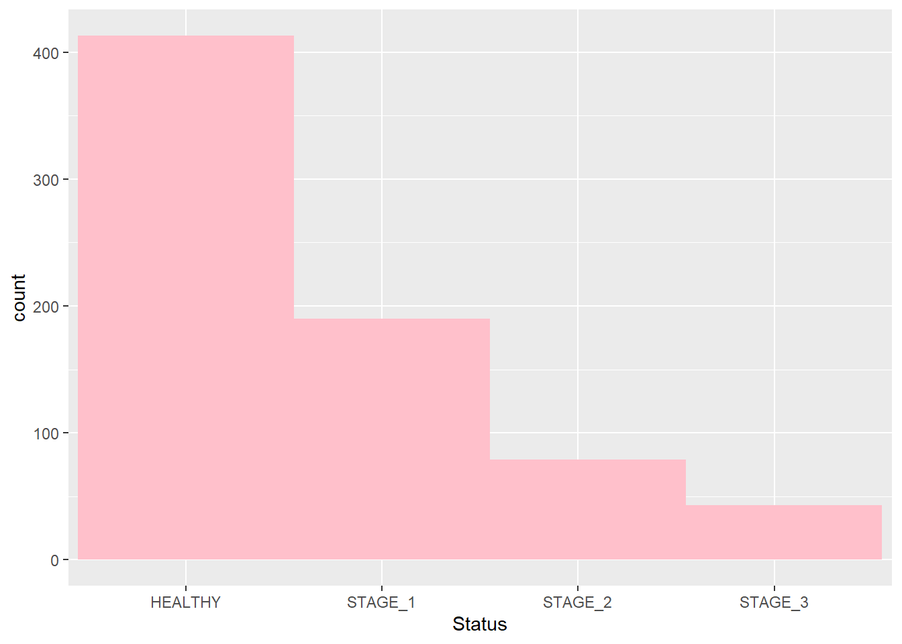

You might also want to change the color of outlines. This is done by adding the `color` argument to the function:


``` r

ggplot(data = dataset1) +
  
geom_bar(mapping = aes(x = Status),
         
         fill = "pink",
         
         color = "blue")
```


If you want the colors of bars be automatically controlled by the levels of the categorical variable, pass the `fill` argument inside the `aes()` function:


``` r

ggplot(data = dataset1) +
  
geom_bar(mapping = aes(x = Status, fill = Status),
           
           width = 0.9)
```


Sometimes you are not interested in displaying all bars together. Instead, you want to focus on certain groups that you are particularly interested in. This can be done using `scale_x_discrete()` and its argument `limits`. Let's display bars corresponding to the  `Healthy` and `Stage_3` categories only:


``` r

ggplot(data = dataset1) +
  
geom_bar(mapping = aes(x = Status, fill = Status),
         
         width = 0.9) +
  
scale_x_discrete(limits = c("HEALTHY", "STAGE_3"))
#> Warning: Removed 269 rows containing non-finite outside the scale
#> range (`stat_count()`).
```

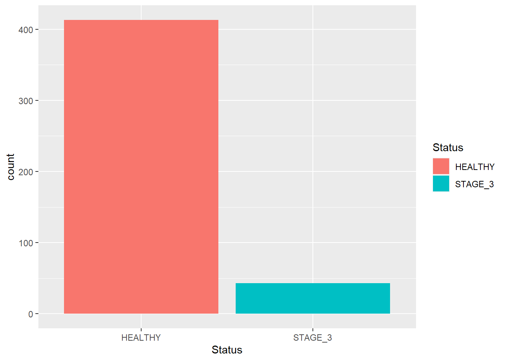

You can also use this function to change the order in which bars appear in your plot:


``` r

ggplot(data = dataset1) +
  
geom_bar(mapping = aes(x = Status, fill = Status),
         
         width = 0.9) +
  
scale_x_discrete(limits = c("STAGE_1", "STAGE_2", "STAGE_3", "HEALTHY"))
```


Knowing the exact frequency of each category is often a requirement. But barplots are often hard to look at, especially when the the scale of y-axis is large. Thus, reading values from a plot becomes an approximation. To fix this issue, we can add labels to the plot. We can put text near the top of each bar to show the exact frequency of the category. It will solve the problem of reading the values from the barplot and will make it more user-friendly.


To do so, we need to add the `geom_text()` function as shown in the code below. Keep the `label` and `stat` arguments as they are shown below; `vjust` argument changes the location of your text, and the `color` arguments changes its color. Below are a few example on how we can utilize this function:


``` r

ggplot(data = dataset1) +
  
geom_bar(mapping = aes(x = Status),
           
           fill = "orange") +
  
geom_text(aes(x = Status,label = ..count..),
            
            stat = "count",
            
            vjust = -0.5,
            
            colour = "black")
#> Warning: The dot-dot notation (`..count..`) was deprecated in
#> ggplot2 3.4.0.
#> ℹ Please use `after_stat(count)` instead.
#> This warning is displayed once every 8 hours.
#> Call `lifecycle::last_lifecycle_warnings()` to see where
#> this warning was generated.
```


``` r

ggplot(data = dataset1) +
  
geom_bar(mapping = aes(x = Status),
         
         fill = "orange") +
  
geom_text(aes(x = Status,label = ..count..),
            
            stat = "count",
            
            vjust = 1.5,
            
            size = 6,
            
            colour = "black")
```


We can even convert frequencies into percentages:


``` r

ggplot(data = dataset1) +
  
geom_bar(mapping = aes(x = Status),
         
         fill = "orange") +
  
geom_text(aes(x = Status,label = scales::percent((..count..)/sum(..count..))),
            
            stat = "count",
            
            vjust = 1.5,
            
            size = 6,
            
            colour = "black")
```

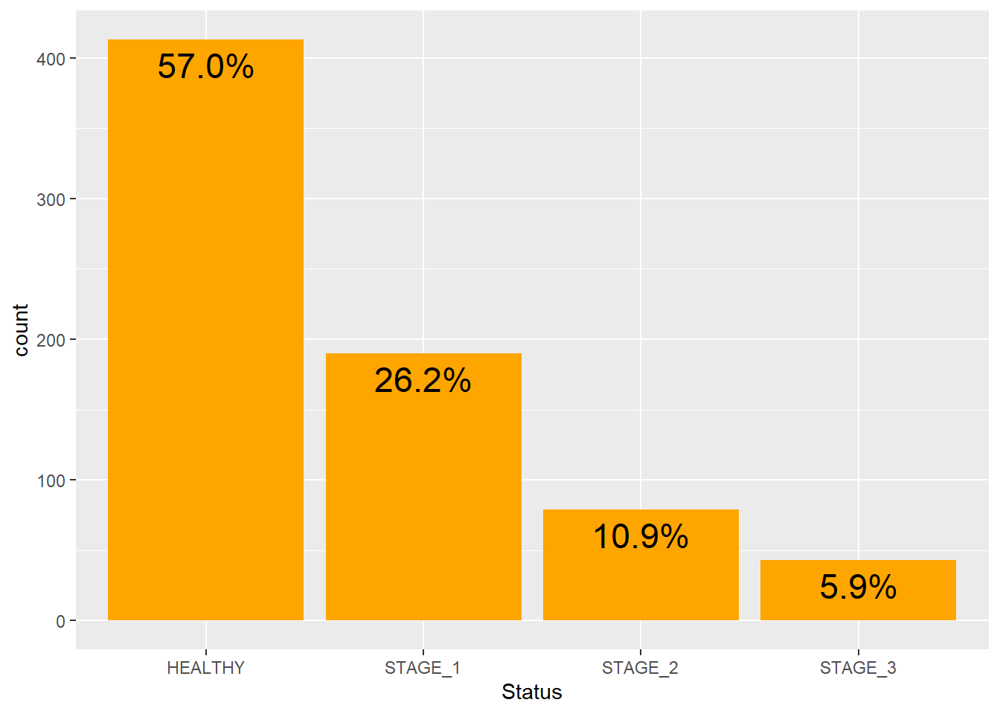

Let's make our barplot more self-explanatory by adding labels to it. By setting `vjust` and `hjust` arguments, you specify the horizontal and vertical positions of an element, respectively:


``` r

ggplot(data = dataset1) +
  
geom_bar(mapping = aes(x = Status, fill = Status)) +
  
labs(title = "Disease Status",
    
     subtitle = "From Lung Capacity Dataset",
    
     x = "STATUS",
    
     y = "COUNT",
    
     caption = "STAT2102: Lecture 15") +
  
theme_classic() +
  
theme(plot.title = element_text(hjust = 0.5),
        
      plot.subtitle = element_text(hjust = 1),
        
      plot.caption = element_text(hjust = 0))
```

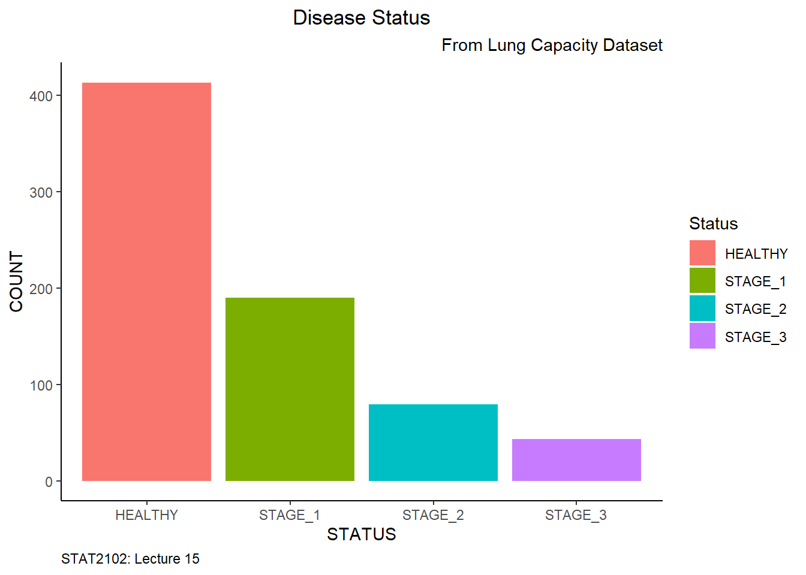


Stacked and grouped barplots are used to reflect other categorical variables in the bars. Let's display a stacked barplot that will reflect the `Sex` variable in our barplot:


``` r

ggplot(data = dataset1) +
  
geom_bar(mapping = aes(x = Status, fill = Sex)) 
```

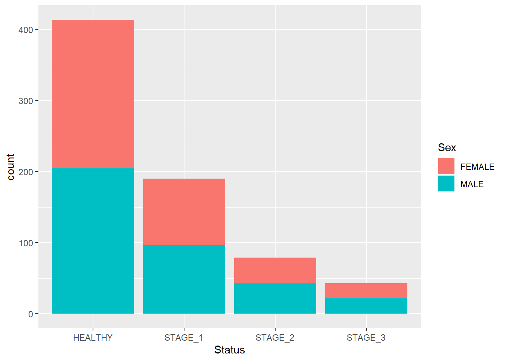

Now we can even change the colors of segments manually:


``` r

ggplot(data = dataset1) +
  
geom_bar(mapping = aes(x = Status, fill = Sex)) +
  
scale_fill_manual(values = c(FEMALE = "tomato",
                                
                             MALE = "steelblue"))
```


Like we did with a simple barplot, we can add labels to the segments of a stacked barplot to display the actual frequency of the segments:


``` r

ggplot(data = dataset1) +
  
geom_bar(mapping = aes(x = Status, fill = Sex)) +
  
scale_fill_manual(values = c(FEMALE = "tomato",
                               
                             MALE = "steelblue")) +
  
geom_text(aes(x = Status, fill = Sex, label = ..count..),
            
            stat = "count",
            
            position = position_stack(vjust = 0.5),
            
            size = 4,
            
            colour = "black")
#> Warning in geom_text(aes(x = Status, fill = Sex, label =
#> ..count..), stat = "count", : Ignoring unknown aesthetics:
#> fill
```


 
Having the bars of the same heights helps us to compare the proportions of segments rather than their actual counts. To achieve this, use the `position` argument and pass `fill` to it:


``` r

ggplot(data = dataset1) +
  
geom_bar(mapping = aes(x = Status, fill = Sex),
         
         position = "fill") 
```

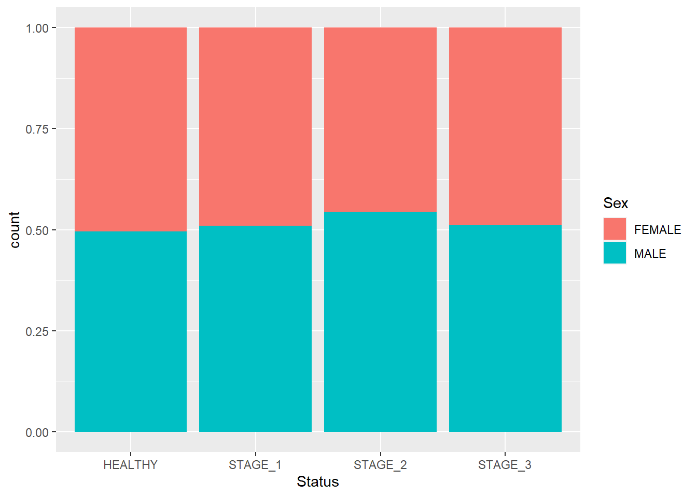


Grouped barplots display bars corresponding to other categorical variables next to each other instead of on top of each other. To display a grouped barplot, you need to add the `position` argument to the `geom_bar()` function and pass `position_dodge()` to it:


``` r

ggplot(data = dataset1) +
  
geom_bar(mapping = aes(x = Status, fill = Sex),
         
         position = position_dodge()) +
  
scale_fill_manual(values = c(FEMALE = "tomato",
                               
                             MALE = "steelblue"))
```

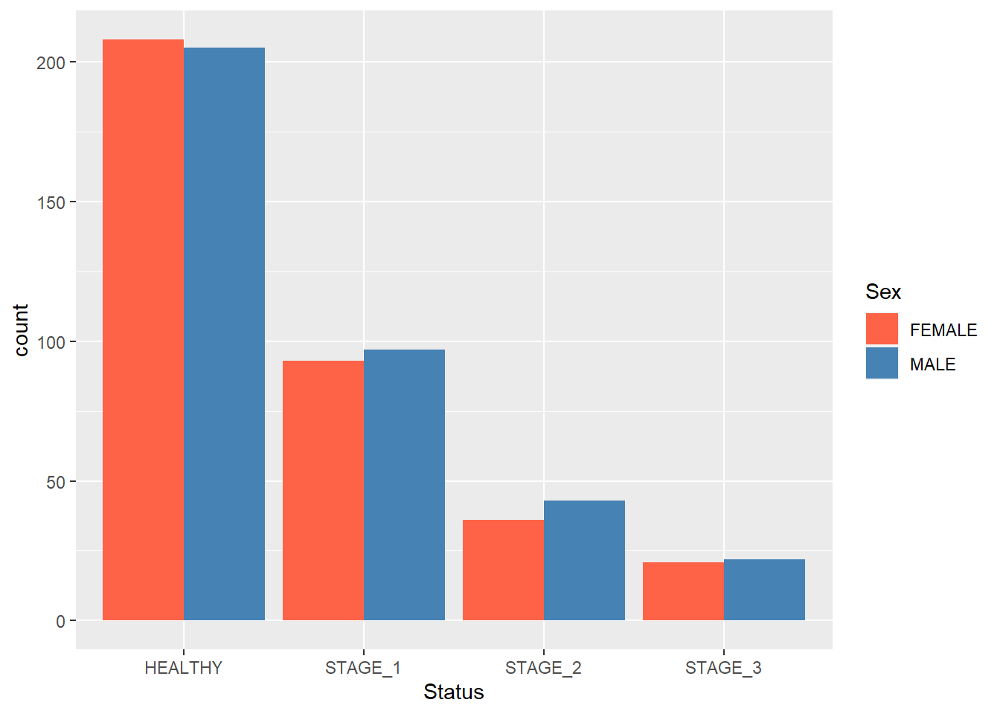

Let's add the labels to these bars to reflect the actual count of the groups:


``` r

ggplot(data = dataset1) +
  
geom_bar(mapping = aes(x = Status, fill = Sex),
         
         position = position_dodge()) +
  
scale_fill_manual(values = c(FEMALE = "tomato",
                               
                             MALE = "steelblue")) +
  
geom_text(aes(x = Status, fill = Sex,label = ..count..),
            
            stat = "count",
            
            position = position_dodge(0.9),
            
            vjust = 1.5,
            
            size = 4,
            
            colour = "black")
#> Warning in geom_text(aes(x = Status, fill = Sex, label =
#> ..count..), stat = "count", : Ignoring unknown aesthetics:
#> fill
```


Sometimes you will want to add an extra touch to your barplots. For instance, you can add a horizontal line to it to visually filter out groups that have more/less observations than a certain value. This is done by adding a `geom_hline()` function. Suppose you want to see which groups have more than 100 observations:


``` r

ggplot(data = dataset1) +
  
geom_bar(mapping = aes(x = Status, fill = Sex),
         
         position = position_dodge()) +
  
scale_fill_manual(values = c(FEMALE = "tomato",
                               
                             MALE = "steelblue")) +
  
geom_hline(yintercept = 100,
           
           linetype = "dashed",
           
           size = 1)
#> Warning: Using `size` aesthetic for lines was deprecated in ggplot2
#> 3.4.0.
#> ℹ Please use `linewidth` instead.
#> This warning is displayed once every 8 hours.
#> Call `lifecycle::last_lifecycle_warnings()` to see where
#> this warning was generated.
```


Finally, use `coord_flip()` to turn a vertical barplot into a horizontal one:


``` r

ggplot(data = dataset1) +
  
geom_bar(mapping = aes(x = Status, fill = Sex),
         
         position = position_dodge()) +
  
scale_fill_manual(values = c(FEMALE = "tomato",
                               
                             MALE = "steelblue")) +
  
coord_flip()
```

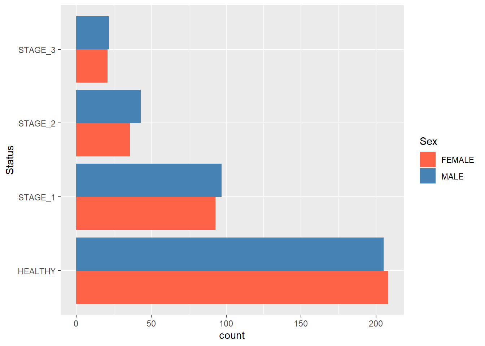


&nbsp;

### Boxplots {-}

In short, boxplots are used to visualize 5-number summary. It is an excellent data visualization tool for statisticians and researchers looking to visualize data distributions. `ggplot2` has a great set of tools that helps you create boxplots and adjust their features. 

Let's start off with a simple boxplot that we are going to create for the `Age` variable. This is done using the `geom_boxplot()` function:


``` r

ggplot(data = dataset1) +
  
geom_boxplot(aes(y = Age))
```

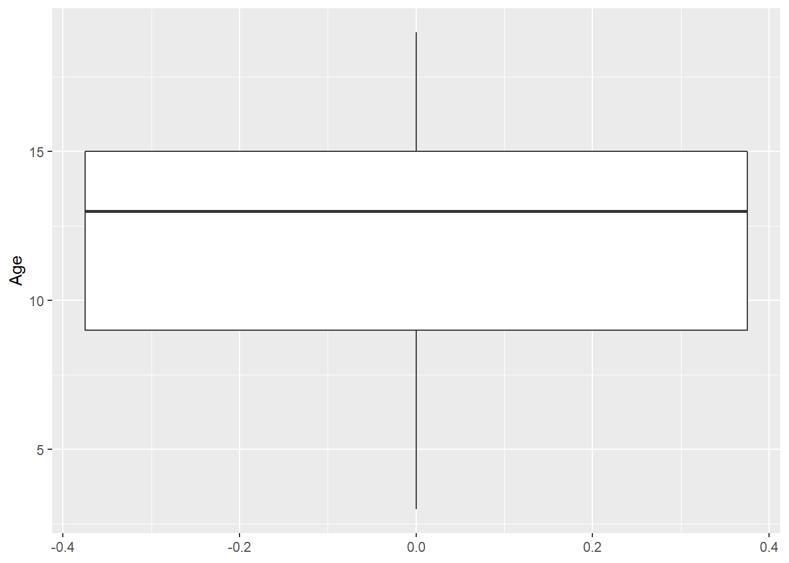


Changing colors and other features of a boxplot is similar to what we did with barplots. Thus, we will skip most of these features here. Just for the illustrative purposes, let's change the color of the boxplot and add a notch:


``` r

ggplot(data = dataset1) +
  
geom_boxplot(aes(y = Age),
             
             fill = "orange",
             
             notch = TRUE)
```


Often, you’ll want to visualize multiple boxplots on a single chart, each representing a distribution of the variable with some filter condition applied. For instance, you can visualize the distribution of `Age` for every possible level of the `Status` variable:


``` r

ggplot(data = dataset1) +
  
geom_boxplot(aes(x = Status, y = Age))
```


Let's change the color of boxplots that will reflect the levels of `Status`:


``` r

ggplot(data = dataset1) +
  
geom_boxplot(aes(x = Status, y = Age, fill = Status))
```


You can also create multiple boxplots for each level of the `Status` variable that will reflect other categorical features:


``` r

ggplot(data = dataset1) +
  
geom_boxplot(aes(x = Status, y = Age, fill = Sex))
```


The previous boxplot contained an outlier - an observation that stands out from the rest of data. To customize outliers, use the following code:


``` r

ggplot(data = dataset1) +
  
geom_boxplot(aes(x = Status, y = Age, fill = Sex),
               
             outlier.colour = "red",
               
             outlier.shape = 8,
               
             outlier.size = 4)
```

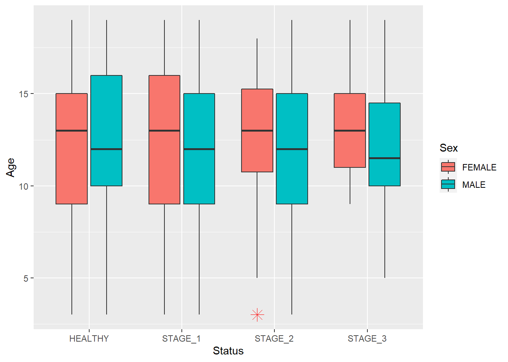


As mentioned earlier, boxplots visualize 5-number summary of data. They don't display the actual observations. If you want to add datapoints to your boxplot, you need to add the `geom_dotplot()` function:


``` r

ggplot(data = dataset1, aes(x = Status, y = Age)) +
  
geom_boxplot() +
  
geom_dotplot(binaxis = "y",
             
             stackdir = "center",
             
             dotsize = 0.3)
#> Bin width defaults to 1/30 of the range of the data. Pick
#> better value with `binwidth`.
```

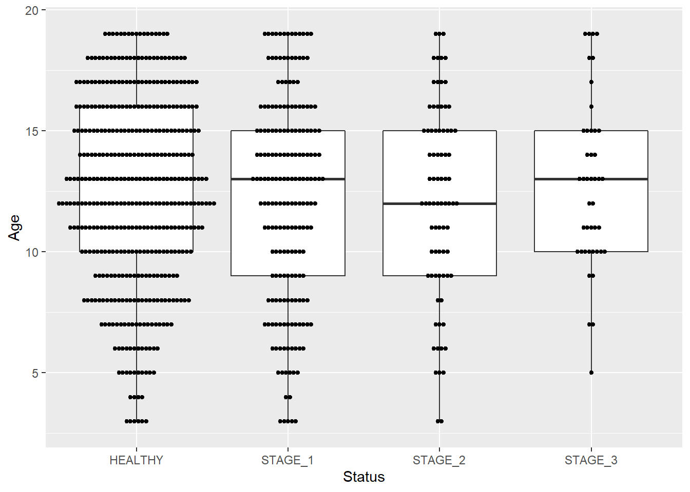


Boxplots show the median as a thick line somewhere in the box. But what if you also want to show the mean value? The `stat_summary()` function does the trick. You can use this function to specify any function and shape, but let's stick with the mean value:


``` r

ggplot(data = dataset1) +
  
geom_boxplot(aes(x = Status, y = Age, fill = Status)) +
  
stat_summary(aes(x = Status, y = Age, fill = Status),
               
             fun = "mean",
               
             geom = "point",
               
             color = "black")
```

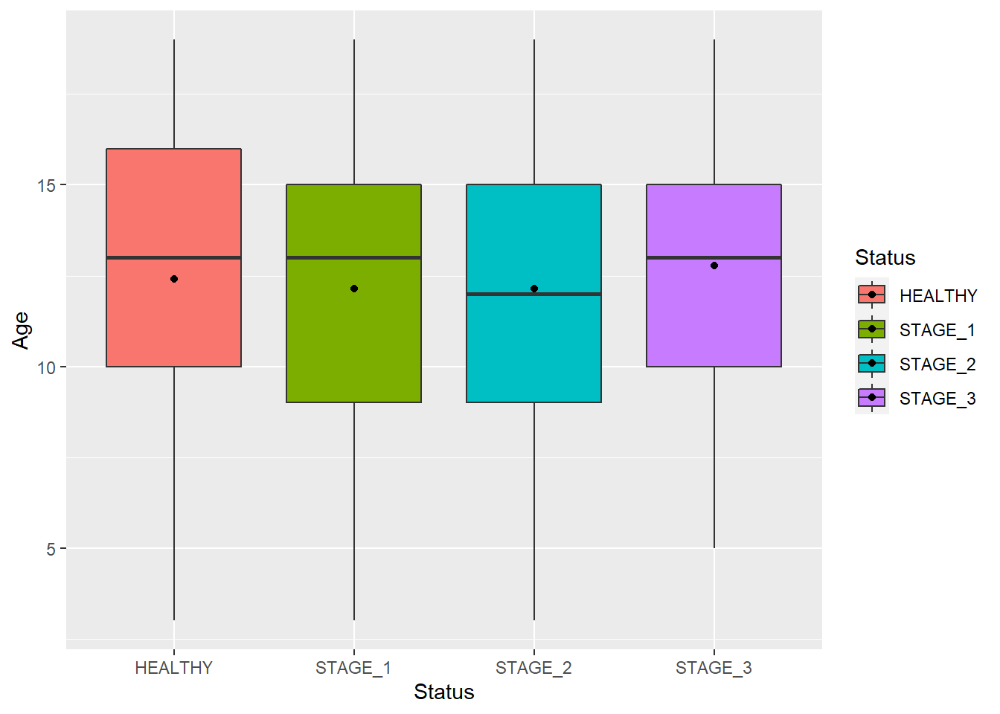


Quite often you will need to show relationships between variables as a scatterplot, and on the margins, you will also need to show the distribution of each variable. `ggplot2` itself does not provide this functionality, so we have to install an additional package called `ggExtra`:


``` r

library(ggExtra)


gg <- ggplot(data = dataset1) +
  
      geom_point(mapping = aes(x = Age, y = LungCap, color = Sex))


  
ggMarginal(gg, type = "boxplot")
```


&nbsp;

### Histograms {-}

Histograms are used to describe the distribution of a continuous variable. A basic histogram can be created using the `geom_histogram()` function. All it requires is a continuous variable:


``` r

ggplot(data = dataset1) +
    
geom_histogram(aes(x = LungCap))
#> `stat_bin()` using `bins = 30`. Pick better value with
#> `binwidth`.
```


Similar to barplots and boxplots, you can change histogram features by adding arguments to the function. Let's change the color and width of bins, and make them transparent at some extend; also let's change the outline type:


``` r

ggplot(data = dataset1) +
    
geom_histogram(aes(x = LungCap),
                 
               fill = "tomato",
                 
               color = "black",
               
               alpha = 0.3,
                 
               binwidth = 0.9,
               
               linetype = "dashed") 
```

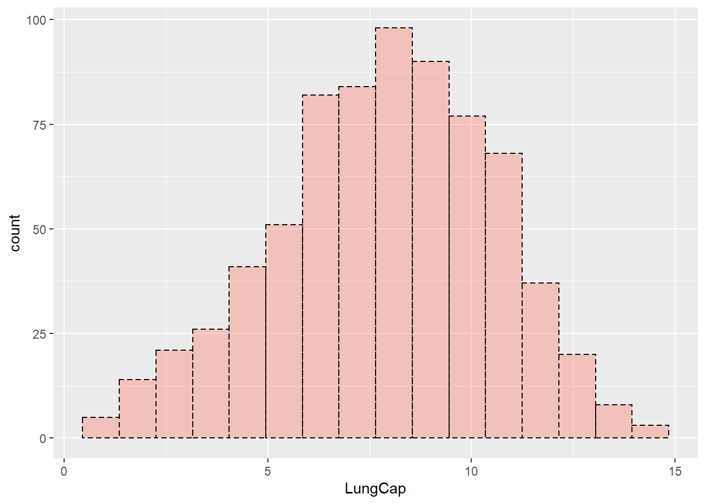

You can also add new features to a histogram. For instance, let's add a vertical line that represents the mean value of our continuous variable:


``` r

ggplot(data = dataset1) +
    
geom_histogram(aes(x = LungCap), 
                   
               fill = "tomato",
                   
               alpha = 0.3,
                   
               color = "black") +
    
geom_vline(aes(xintercept = mean(LungCap)),
               
           color = "blue",
               
           size = 1)
#> `stat_bin()` using `bins = 30`. Pick better value with
#> `binwidth`.
```


`ggplot2` allows you to add density curves to a histogram. This is done using the `geom_density()` function:


``` r
ggplot(data = dataset1) +
    
geom_histogram(aes(x = LungCap, y = ..density..),
                   
               fill = "white", 
                   
               color = "black") +
    
geom_density(aes(x = LungCap),
                 
             alpha = 0.3,
                 
             fill = "tomato")
#> `stat_bin()` using `bins = 30`. Pick better value with
#> `binwidth`.
```


Now let's change the color of bins so that it will reflect another categorical feature (for example, the `Sex` variable):


``` r

ggplot(data = dataset1) +
    
geom_histogram(aes(x = LungCap, fill = Sex, color = Sex),
               
               alpha = 0.5)
#> `stat_bin()` using `bins = 30`. Pick better value with
#> `binwidth`.
```

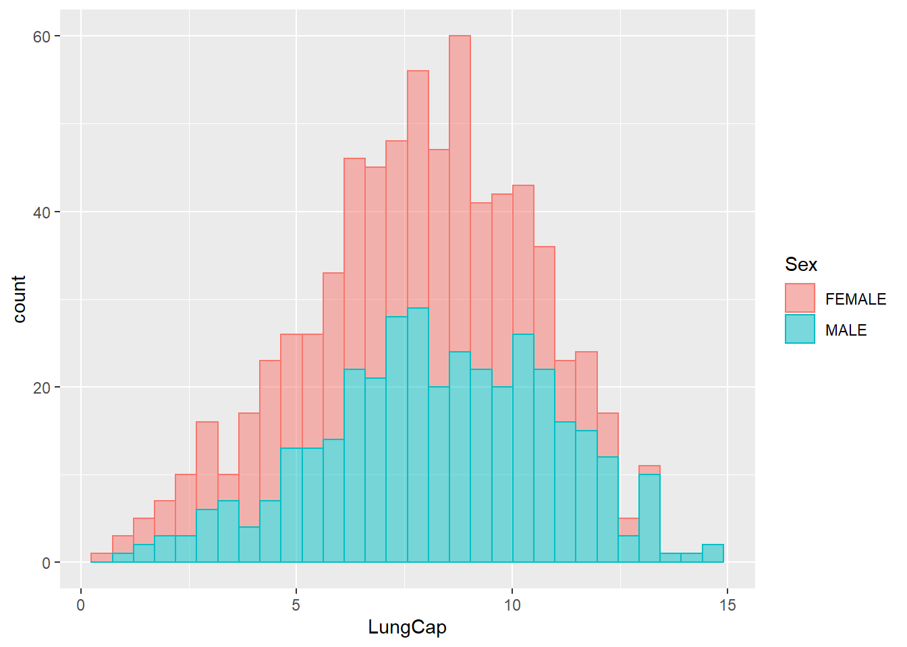

Let's add vertical lines that correspond to the mean values of these two groups:


``` r

# Preparing inputs 

data_summary = dataset1 %>% 
  
               group_by(Sex) %>%
  
               summarise(grp.mean = mean(LungCap))


# Plotting the lines
  
ggplot(data = dataset1) +
    
geom_histogram(aes(x = LungCap, fill = Sex, color = Sex),
               
               alpha = 0.5) +
    
geom_vline(data = data_summary, 
               
           aes(xintercept=grp.mean, color=Sex),
               
           linetype="dashed",
               
           size = 1) 
#> `stat_bin()` using `bins = 30`. Pick better value with
#> `binwidth`.
```


&nbsp;

### Arranging Plots {-}

Often you would want to show two or more plots side by side to show different aspects of the same story in a compelling way. This can be achieved using `ggplot2`'s one of the extensions, `patckwork` package. You will need to install this package and load it.


At it’s heart, `patchwork` is a package that extends `ggplot2`’s use of the `+` operator to work between multiple plots, as well as add additional operators for specialized compositions and working with compositions of plots. To illustrate its functionality, first let's create a few ggplot objects:


``` r
g1 <- ggplot(data = dataset1) +
  
      geom_bar(mapping = aes(x = Status, fill = Status), width = 0.9) +
  
      scale_x_discrete(limits = c("STAGE_1", "STAGE_2", "STAGE_3", "HEALTHY"))
  


g2 <- ggplot(data = dataset1) +
  
      geom_boxplot(aes(x = Status, y = Age, fill = Sex))
 


g3 <-   ggplot(data = dataset1) +
  
        geom_histogram(aes(x = LungCap,
                     
                       fill = Sex,
                     
                       color = Sex,
                     
                       alpha = 0.5)) 
  
```

The most simple use of patchwork is to use + to add plots together thus creating an assemble of plots to display together:


``` r

g1 + g2
```


`+` does not specify any specific layout, only that the plots should be displayed together. In the absence of a layout the same algorithm that governs the number of rows and columns in `facet_wrap()` will decide the number of rows and columns. This means that adding 3 plots together will create a 1x3 grid while adding 4 plots together will create a 2x2 grid:


``` r

g1 + g2 + g3
#> `stat_bin()` using `bins = 30`. Pick better value with
#> `binwidth`.
```

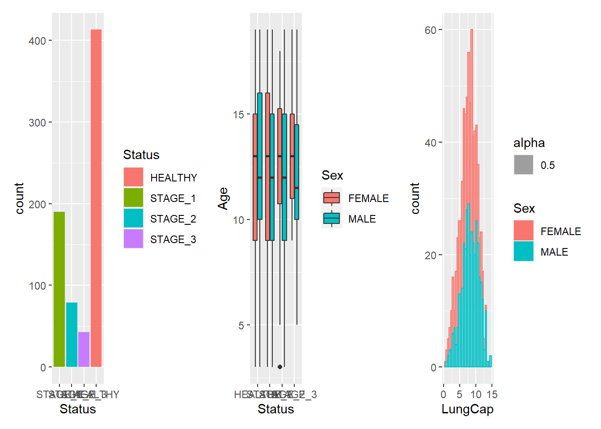

It is often that the automatically created grid is not what you want and it is of course possible to control it. The most direct and powerful way is to do this is to add a `plot_layout()` specification to the plot:


``` r

g1 + g2 + g3 +
  
plot_layout(ncol = 2)
#> `stat_bin()` using `bins = 30`. Pick better value with
#> `binwidth`.
```


A common scenario is wanting to force a single row or column. patchwork provides two operators, `|` and `/` respectively:


``` r

g1/g2
```

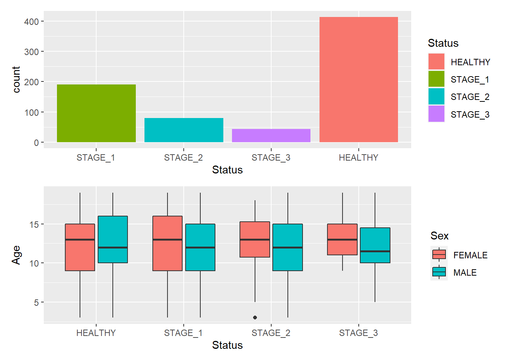


``` r

g1|g2
```


Patchwork allows nesting layouts which means that it is possible to create various layouts using just these two operators:


``` r

g1 | (g2/g3)
#> `stat_bin()` using `bins = 30`. Pick better value with
#> `binwidth`.
```

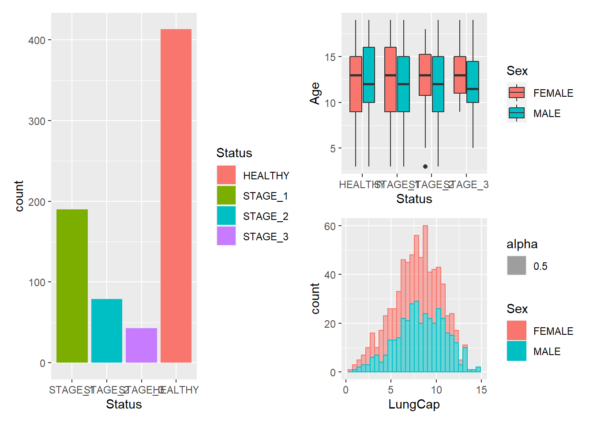
