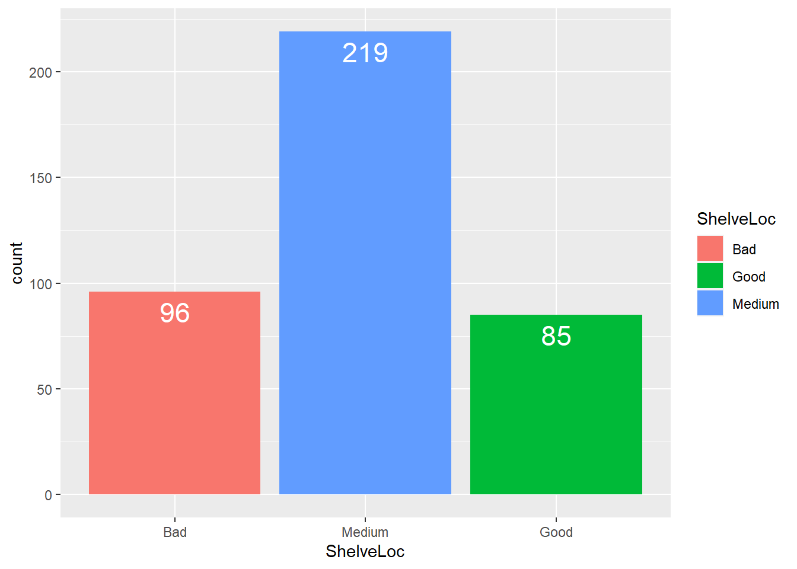

# Module 13 {-} 

&nbsp;

## Data Analysis {-}

### Introduction {-}


Now that we are equipped with enough programming tools we can finally move to the Data Analysis part of the bootcamp. You will use your new tools of data wrangling and programming to perform certain statistical procedures, including Exploratory Data Analysis (EDA) and Formal Inference. In general, EDA is an iterative process that involves

1. Generating questions about your data
2. Searching for answers by visualizing, transforming, and modelling your data
3. Using what you learn to refine your questions and/or generate new questions

EDA is not a formal process with a strict set of rules. During the initial phases of EDA you should feel free to investigate every idea that occurs to you. Some of these ideas will pan out, and some will be dead ends. As your exploration continues, you will home in on a few particularly productive areas that you’ll eventually write up and communicate to others. 

EDA is an important part of any data analysis, because you always need to investigate the quality of your data. Data cleaning is just one application of EDA: you ask questions about whether your data meets your expectations or not. To do data cleaning, you’ll need to deploy all the tools of EDA: visualization, transformation, and modelling.

On the other hand, formal inference is the process of inferring properties of an underlying distribution of a variables. It infers properties of a population by testing hypothesis and deriving estimates. In this module, we will cover _t_ - tests for a population mean (both one sample and two sample tests), $\chi^2$ goodness of fit test and $\chi^2$ test of independence, and predictive models.

In this module, we are not going to cover the aspects of the mathematical theory that underlies models. We will, however, build your intuition about how statistical models work, and give you a family of useful tools (and R functions) that allow you to use models to better understand your data. Specifically, you will learn

1. how models work mechanistically and how to gain insights into what a model tells you about your data
2. how to pull out known patterns in real data

**Note:** The objective of this bootcamp is not exposing you to various statistical models or other theoretical topics. The main focus is to get you familiar with useful R functions that will come in handy when you start your coursework in our MA program. Thus, some of the procedures discussed in this module and the following module might seem to be basic, but they are used to showcase the R functionality.

To illustrate all these tools, we will use the `carseats_full` dataset, which  is available on Courseworks. 

&nbsp;

**Data Description:** A company is interested in studying the sales related to certain products they produce. They collected data on sales of child car seats at 400 different stores. The data contains the following variables:

* **Sales** - Unit sales (in thousands) at each location
* **CompPrice** - Price charged by competitor at each location
* **Income** - Community income level (in thousands of dollars)
* **Advertising** - Local advertising budget for company at each location (in thousands of dollars)
* **Population** - Population size in region (in thousands)
* **Price** - Price the company charges for car seats at each site
* **ShelveLoc** - A factor variables with levels _Bad_, _Good_, and _Medium_ indicating the quality of the shelving location for the car seats at each site
* **Age** - Average age of the local population
* **Education** - Education level at each location
* **Urban** - A factor variable with levels _No_ and _Yes_ to indicate whether the store is in an urban or rural location
* **US** - A factor variable with levels _No_ and _Yes_ to indicate whether the store is in the US or not

&nbsp;

### Hypothesis Tests {-}


In statistics, a **population** is the total group of individuals or objects that you want to make conclusions about. In other words, it is the totality of the individuals or objects that are of interest in a statistical study. Typically, we cannot observe every individual/object in the population due to limitations. Instead of measuring every item in a population, we take a **sample**. A sample is a subset of the cases that is often a small fraction of the overall population.

A summary value calculated from a population is called a **parameter**. Similarly, a summary value calculated from samples is called a **statistic**. A parameter can be estimated from sample data either by a single number (a **point estimate**) or an entire interval of plausible values (a **confidence interval**). Frequently, however, the objective of an investigation is not to estimate a parameter but to decide which of two contradictory claims about the parameter is correct.

Methods for accomplishing this comprise the part of statistical inference called **hypothesis testing**. A **statistical hypothesis** is a claim or assertion either about the value of a single parameter, about the values of several parameters, or about the form of an entire probability distribution. A hypothesis test is used to determine whether results obtained from a sample are convincing enough to allow us to infer something about a population.

In any hypothesis-testing problem, there are two contradictory hypotheses under consideration:

* The **Null Hypothesis**, denoted by $H_0$, is the claim that is initially assumed to be true. It is the claim that any difference we see in sample results compared to the population is **due to chance**, that is, due to uninteresting variation or randomness in the sampling distribution that is expected.
* The **Alternative Hypothesis**, denoted by $H_a$, is the assertion that is contradictory to $H_0$. It is the claim that the difference in sample results compared to the population **is NOT due to chance**.


There are two types of hypotheses:

* An alternative hypothesis that is equally interested in deviations on either side of the null hypothesis value is called **two-sided alternative** and the corresponding hypothesis test is called a **two-sided test**.
* An alternative hypothesis that focuses on deviations from the null hypothesis value in only one direction is called a **one-sided alternative** and the corresponding hypothesis test is called a **one-sided test**.

The null hypothesis will be rejected in favor of the alternative hypothesis only if sample evidence suggests that $H_0$ does not fit the data well. If the sample does not strongly contradict $H_0$, we will continue to believe in the plausibility of the null hypothesis. The two possible conclusions from hypothesis-testing analysis are then **reject** $H_0$ or **fail to reject** $H_0$.

To help us evaluate the null model (the model under the null hypothesis), we use a probability called a **P-value**. This probability is calculated assuming that the null hypothesis is true. If the p-value is **large**, this indicates that our observed results look like they could be a result of the natural variation that we expect to see when we take random sample. **A large p-value supports the null hypothesis.**

On the other hand, the **smaller** a p-value is, the less inclined we will be to think that our sample result is simply due to natural variation. **A small p-value supports the alternative hypothesis**.

In other words, the p-value is the probability, calculated assuming that the null hypothesis is true, of obtaining a value of the test statistic at least as contradictory to $H_0$ as the value calculated from the available sample data.

A **Test Statistic** is a function of the sample data used as a basis for deciding whether $H_0$ should be rejected. Values of the test statistic that tend to result when $H_0$ is true should be quite different from those typically observed when $H_0$ is not true.

A conclusion is reached in a hypothesis testing analysis by selecting a number $\alpha$, called the **significance level** of the test, that is reasonably close to 0:

* Then $H_0$ will be rejected in favor of $H_a$ if p-value $\leq$ $\alpha$
* Whereas $H_0$ will not be rejected if p-value > $\alpha$

&nbsp;

In general, the basic structure of hypothesis test is as follows:

1. An overall model and related assumptions are made
2. The null and alternative hypotheses are specified. Usually the null hypothesis specifies a particular value of a parameter
3. With given data, the value of the test statistic is calculated
4. Under the general assumptions, as well as assuming the null hypothesis is true, the distribution of the test statistic is known
5. Given the distribution and value of the test statistic, as well as the form of the alternative hypothesis, a p-value is calculated
6. Based on the p-value and pre-specified level of significance, a conclusion is made.


In this module we will consider hypothesis tests concerning various population parameters. We will start off with a population mean.

&nbsp;

#### One Sample t-test for a Population Mean {-}

In the context of testing about the value of a population mean $\mu$, the possible hypothesis statements are:

\begin{align*}
H_0: \mu = \mu_0  \quad versus \quad H_a: \mu \neq \mu_0
\end{align*}

\begin{align*}
H_0: \mu = \mu_0  \quad versus \quad H_a: \mu > \mu_0
\end{align*}

\begin{align*}
H_0: \mu = \mu_0  \quad versus \quad H_a: \mu < \mu_0
\end{align*}


A test statistic is given by

\begin{align*}
t = \frac{\bar{x} - \mu_0}{s/\sqrt{n}} \sim t(n-1)
\end{align*}

And a $100(1-\alpha)\%$ confidence interval for $\mu$ is given by

\begin{align*}
\bar{x} \pm t_{\alpha/2, n-1}\frac{s}{\sqrt{n}}
\end{align*}


In order to perform a one-sample t-test, the following condition must be met:

1. Observations must be independent of one another
2. Population distribution must be nearly normal **OR** the sample size must be sufficiently large (usually, a sample size of 30 is enough to satisfy this condition)

In this module, you will not be asked to manually calculate the test statistic and make a conclusion. Instead, you will be using an R function to get these results. To illustrate it, let's go back to our `carseats_full` dataset.

**Example**:

Suppose a researcher at the company suspects that stores on average spend more than \$5000 on advertising, which might not be reasonable given the company's budget. Since they don't have access to the data from all available stores, instead they will use a sample of 400 stores to perform a statistical test to check their hypothesis. They would like to test it at the $\alpha = 0.05$ significance level.

For a given question, the null and alternative hypotheses are given by


\begin{align*}
H_0: \mu = 5  \quad versus \quad H_a: \mu > 5
\end{align*}

To perform a test, we use a `t.test()` function from R. It has the following arguments:

* `x` - a (non-empty) numeric vector of data values
* `y` - an optional (non-empty) numeric vector of data values
* `alternative` - a character string specifying the alternative hypothesis, must be one of **"two.sided"** (default), **"greater"** or **"less"**. You can specify just the initial letter
* `mu`  - a number indicating the true value of the mean (or difference in means if you are performing a two sample test)
* `var.equal` - a logical variable indicating whether to treat the two variances as being equal. If TRUE then the pooled variance is used to estimate the variance otherwise the Welch (or Satterthwaite) approximation to the degrees of freedom is used
* `conf.level` - confidence level of the interval


Now since we work with a single population, we don't need the `y` argument (we will come back to it shortly). Here `x` is a vector of the `Advertising` variable, `mu` is 5, `alternative` is `greater` (this options should correspond to the alternative hypothesis), `conf.level` is 0.95, and for a one-sample test with don't need the `var.equal` argument (again, we will come back to this argument shortly). Thus,


```r

t.test(x = dataset1$Advertising,
       
       alternative = "greater",
       
       mu = 5,
       
       conf.level = 0.95)
#> 
#> 	One Sample t-test
#> 
#> data:  dataset1$Advertising
#> t = 4.917, df = 399, p-value = 6.431e-07
#> alternative hypothesis: true mean is greater than 5
#> 95 percent confidence interval:
#>  6.086783      Inf
#> sample estimates:
#> mean of x 
#>     6.635
```

The function output provides information about the test statistic (t = 4.917), degrees of freedom (df = 399) and the p-value. From the output we can see that the p-value is approximately 0 and it is less than the significance level $\alpha = 0.05$, thus, we reject the $H_0$ hypothesis.

We conclude that, based on the sample data, we have evidence that the stores on average spend more than $5000 on advertising, so the leadership might want to send a note to the store managers asking to cut the advertising budgets.

&nbsp;

#### Two Sample t-test for a Difference between Population Means {-}

So far we've worked with only one population mean. What if we want to compare means taken from two populations? In this case, you have to perform a two-sample t-test. In the context of testing about the difference between two population means, the possible hypotheses are:


\begin{align*}
H_0: \mu_1 - \mu_2 = \mu_0  \quad versus \quad H_a: \mu_1 - \mu_2 \neq \mu_0
\end{align*}

\begin{align*}
H_0: \mu_1 - \mu_2 = \mu_0  \quad versus \quad H_a: \mu_1 - \mu_2 > \mu_0
\end{align*}

\begin{align*}
H_0: \mu_1 - \mu_2 = \mu_0 \quad versus \quad H_a: \mu_1 - \mu_2 < \mu_0
\end{align*}


A test statistic is given by

\begin{align*}
t = \frac{(\bar{x}_1 - \bar{x}_2) - \mu_0}{\sqrt{s_1^2/n_1 + s_2^2/n_2}} \sim t(n_1 + n_2 - 2)
\end{align*}

And a $100(1-\alpha)\%$ confidence interval for the difference between two population means is given by

\begin{align*}
(\bar{x}_1 - \bar{x}_2) \pm t_{\alpha/2, n_1 + n_2 - 2}\sqrt{s_1^2/n_1 + s_2^2/n_2}
\end{align*}


In order to perform a two-sample t-test, the following condition must be met:

1. Observations in each group must be independent of one another
2. Two groups must be independent of one another
3. Population distributions must be nearly normal **OR** the sample sizes must be sufficiently large (usually, a sample size of 30 is enough to satisfy this condition)
4. The population variances must be equal

&nbsp;

**Example 1:**

The same researcher thinks that the sales on average might be higher in the stores located in rural areas since people in these areas tend to use cars more often. In other words, $\mu_R - \mu_U > 0$. She wants to test her hypothesis at the $\alpha = 0.02$ significance level. For a given research question, the null and alternative hypotheses are:


\begin{align*}
H_0: \mu_R - \mu_U = 0  \quad versus \quad H_a: \mu_R - \mu_U > 0
\end{align*}


Before we perform a formal test, let's visualize our data:


```r

data_summary = dataset1 %>% 
  
               group_by(Urban) %>%
  
               summarise(grp.mean = mean(Sales))


# Plotting the lines
  
ggplot(data = dataset1) +
    
geom_histogram(aes(x = Sales, fill = Urban, color = Urban),
               
               alpha = 0.5) +
    
geom_vline(data = data_summary, 
               
           aes(xintercept=grp.mean, color=Urban),
               
           size = 1) 
#> `stat_bin()` using `bins = 30`. Pick better value with
#> `binwidth`.
```


As it was mentioned, one of the assumptions of a two-sample t-test is that the populations variances must be equal. First, we have to check this assumption by performing another test called **Levene's test**. To do so, we will use the `LeveneTest()` function. This function is available in the `car` package, thus, first you will need to install this package:


```r

library(car)
#> Loading required package: carData
#> 
#> Attaching package: 'car'
#> The following object is masked from 'package:dplyr':
#> 
#>     recode
#> The following object is masked from 'package:purrr':
#> 
#>     some

leveneTest(Sales ~ Urban, data = dataset1)
#> Levene's Test for Homogeneity of Variance (center = median)
#>        Df F value Pr(>F)
#> group   1       0 0.9986
#>       398
```

The p-value of this test is extremely high, which indicates that the variances of two populations are equal. Thus, in the `t.test` the `var.equal` argument will be set to `TRUE`:


```r

Rural <- dataset1 %>%
  
         filter(Urban == "No") %>%
          
         select(Sales)

Urban <- dataset1 %>%
  
         filter(Urban == "Yes") %>%
          
         select(Sales)


t.test(x = Rural,
       
       y = Urban,
       
       alternative = "greater",
       
       mu = 0,
       
       var.equal = TRUE,
       
       conf.level = 0.98)
#> 
#> 	Two Sample t-test
#> 
#> data:  Rural and Urban
#> t = 0.30765, df = 398, p-value = 0.3793
#> alternative hypothesis: true difference in means is greater than 0
#> 98 percent confidence interval:
#>  -0.543356       Inf
#> sample estimates:
#> mean of x mean of y 
#>  7.563559  7.468191
```


Since the p-value 0.3793 is greater than the significance level 0.02, we fail to reject the null hypothesis and we conclude that there is no statistical difference between average sales in Rural and Urban areas.


**Example 2:**

Now suppose we would like to test the claim that on average stores in the US and outside of the US are equally profitable. In other words, the sales in the stores located in the US and outside of the US are on average equal. We want to test this claim at the $\alpha = 0.05$ significance level. The null and alternative hypotheses are given by:

\begin{align*}
H_0: \mu_{US} - \mu_{non\_US} = 0  \quad versus \quad H_a: \mu_{US} - \mu_{non\_US} \neq 0
\end{align*}


Let's visualize our data:


```r

ggplot(data = dataset1) +
  
geom_boxplot(aes(x = US, y = Sales, fill = US)) +
  
stat_summary(aes(x = US, y = Sales, fill = US),
               
             fun = "mean",
               
             geom = "point",
               
             color = "black")
```


From the plot we observe that on average sales in the stores located in the US are higher than the sales in the stores located outside of the US. But is this difference statistically significant? We are about to find it out. 

As usual, before we perform a formal t-test, let's test the assumption of equal variances at the 5% significance level:


```r

leveneTest(Sales ~ US, data = dataset1)
#> Levene's Test for Homogeneity of Variance (center = median)
#>        Df F value  Pr(>F)  
#> group   1  3.6316 0.05741 .
#>       398                  
#> ---
#> Signif. codes:  
#> 0 '***' 0.001 '**' 0.01 '*' 0.05 '.' 0.1 ' ' 1
```

Since the p-value 0.05741 is greater than 0.05, we assume that the variances are equal. Now we move on to the t-test:


```r

t.test(Sales ~ US, 
       
       data = dataset1,
       
       mu = 0,
       
       alternative = "two.sided",
       
       var.equal = TRUE,
       
       conf.level = 0.95)
#> 
#> 	Two Sample t-test
#> 
#> data:  Sales by US
#> t = -3.5897, df = 398, p-value = 0.0003723
#> alternative hypothesis: true difference in means between group No and group Yes is not equal to 0
#> 95 percent confidence interval:
#>  -1.6155534 -0.4721887
#> sample estimates:
#>  mean in group No mean in group Yes 
#>          6.823028          7.866899
```

Since the p-value of 0.00037 is less than the significance level 0.05, we reject the null hypothesis and conclude that on average stores in the US and outside of the US have different profitability.


#### $\chi^2$ Goodness of Fit Test (GOF) {-}

Sometimes you are interested to check whether your data comes from a specified distribution or not. The $\chi^2$ (chi-squared) goodness of fit test helps you answer this question. In chi-squared goodness of fit test, the term goodness of fit is used to compare the observed sample distribution with the expected probability distribution. In this module, we will perform a chi-squared goodness of fit test on categorical variables. 

In the context of the chi-squared goodness of fit test, the test statistic is given by:

\begin{align*}
\chi^2 = \sum_{i = 1}^{k}\frac{(observed_i - expected_i)^2}{expected_i}
\end{align*}

where $observed_i$ is the observed frequency of the level $i$ and $expected_i$ is the expected frequency of the level $i$ under the null hypothesis, and $k$ is the number of levels of the categorical variable. 

In order to perform a chi-squared goodness of fit test, the following condition must be met:

1. Each case that contributes a count to the table must be independent of all other cases in the table.
2. The expected counts for each level of the categorical variable must be at least 5.
3. There must be at least 3 levels of the categorical variable.

&nbsp;

Let's consider an example to better understand how this test works:

**Example:**

Data analysts at the company believe that in order to achieve the desired number of sales for their child car seat product, 55% of the items should be placed on medium quality shelves, 25% on good quality shelves, and the remaining 20% can be placed on bad quality shelves. Thus, the desired distribution of the `ShelveLoc` variable is


Bad | Medium | Good |
-------- |---------|---------|
20%     |55% | 25%  | 


Now let's check whether the sample distribution follows the distribution given in the table above. In other words, we are going to test whether the sample data fits the specified distribution well. The null and alternative hypotheses that correspond to our research question are given by


$H_0$: The distribution of shelve locations is **the same as** the distribution proposed by the analysts. The observed difference is due to chance.


$H_a$: The distribution of shelve locations is **different from** the distribution proposed by the analysts. The observed difference is not due to chance.


Before we test these hypotheses, let's visualize our sample data:


```r

ggplot(data = dataset1) +
  
geom_bar(mapping = aes(x = ShelveLoc, fill = ShelveLoc),
         
         width = 0.9) +
  
scale_x_discrete(limits = c("Bad", "Medium", "Good")) + 
  
geom_text(aes(x = ShelveLoc,label = ..count..),
            
            stat = "count",
            
            vjust = 1.5,
          
            size = 6,
            
            colour = "white")
```




Let's convert the count frequency into percentages:


```r

ggplot(data = dataset1) +
  
geom_bar(mapping = aes(x = ShelveLoc, fill = ShelveLoc),
         
         width = 0.9) +
  
scale_x_discrete(limits = c("Bad", "Medium", "Good")) + 
  
geom_text(aes(x = ShelveLoc,label = scales::percent((..count..)/sum(..count..))),
            
            stat = "count",
            
            vjust = 1.5,
          
            size = 6,
            
            colour = "white")
```


As you can notice, the sample distribution differs from the desired distribution of the shelve locations. But is this difference statistically significant? We are going to figure this out. 

In the table below we have the observed and expected counts.The observed counts are obtained from the sample, and the expected counts are calculated assuming the null hypothesis is true. In other words, these are the frequencies you would expect to get if the null hypothesis is true:


Shelve Location | Observed Count | Expected Count |
-------- |---------|---------|
Bad     |96 | $400\times0.2 = 80$  | 
Medium     |219 | $400\times0.55 = 220$  | 
Good    |85 | $400\times0.25 = 100$  | 


Now we use these observed and expected counts to calculate the chi-squared test statistic and then the corresponding p-value. Instead of doing this manually by hand, we are going to use the `chisq.test()` function. This function needs the following arguments:

* `x` - a numeric vector or matrix
* `p` - a vector of probabilities of the same length as `x`


Let's test our hypothesis at the $\alpha = 0.05$ significance level:


```r

chisq.test(x = c(96, 219, 85), p = c(0.2, 0.55, 0.25))
#> 
#> 	Chi-squared test for given probabilities
#> 
#> data:  c(96, 219, 85)
#> X-squared = 5.4545, df = 2, p-value = 0.0654
```
The function output contains the test statistic ($\chi^2$ = 5.4545), degrees of freedom (df = 2), and the p-value. Since the p-value 0.0654 is greater than the significance level 0.05, we fail to reject the $H_0$. Thus, based on our data, the actual distribution of the `ShelveLoc` variable follows the desired distribution.

&nbsp;

#### $\chi^2$ Test of Independence {-}

A chi-squared test of independence is used to check whether two categorical variables are related or not. In other words, it tests whether two categorical variables are independent. In general, if the two categorical variables are related, the probability of one variable having a certain value is dependent on the value of the other variables.

A chi-squared test of independence can be used to test the following set of hypotheses:

$H_0:$ Variable A and Variable B are **independent**. The observed difference is due to chance.

$H_a:$ Variable A and Variable B are **NOT independent**. The observed difference is not due to chance.

A test statistic for this test is identical to what we had for a chi-squared goodness of fit test:

\begin{align*}
\chi^2 = \sum_{i = 1}^{k}\frac{(observed_i - expected_i)^2}{expected_i}
\end{align*}

Again, $observed_i$ is the observed frequency of the level $i$ and $expected_i$ is the expected frequency of the level $i$ under the null hypothesis, and $k$ is the number of levels of the categorical variable.

We have a slightly different set of conditions that need to be met in order to perform a chi-squared test of independence:

1.  Each case that contributes a count to the table must be independent of all other cases in the table.
2. The expected count for each cell of the two-way table must be at least 5.

&nbsp;

To better understand how this test works, let's consider an example.


**Example:**

Suppose you are interested to know whether the `ShelveLoc` and `Urban` variables are related. In other words, you are trying to figure out whether the distribution of items on shelves depends on whether the store is located in rural or urban area. The set of hypotheses that correspond to your research question are

$H_0:$ Variables `ShelveLoc` and `Urban` are **independent**. The observed difference is due to chance.

$H_a:$ Variables `ShelveLoc` and `Urban` are **not independent**. The observed difference is not due to chance.


We are going to test these hypotheses using our sample data at the $\alpha = 0.1$ significance level. The best way to display your sample data is using a two-way contingency table. In a two-way contingency table, rows represent levels(categories) of one categorical variable and columns represent levels of the other categorical variable:


```r

dataset1 %>%
  
  select(Urban, ShelveLoc) %>%
  
  table()
#>      ShelveLoc
#> Urban Bad Good Medium
#>   No   22   28     68
#>   Yes  74   57    151
```

If the variables are independent, that is, they are not related, then the distribution of the `ShelveLoc` variable should be the same for every level of the `Urban` variable and vice versa.

We can visualize our data using a stacked barplot:


```r

ggplot(data = dataset1) +
  
geom_bar(mapping = aes(x = ShelveLoc, fill = Urban),
         
         position = "fill") 
```


Stacked barplots are particularly useful at describing the relationship (or lack of it) between two categorical variables. If some columns on the plot are divided in different vertical locations than others, then this might be an indication that the variable are related, that is, they are not independent. But per usual, to formally test our hypothesis, we need to perform a statistical test. in this case, this would be chi-squared test of independence:


```r

chisq.test(dataset1$ShelveLoc, dataset1$Urban)
#> 
#> 	Pearson's Chi-squared test
#> 
#> data:  dataset1$ShelveLoc and dataset1$Urban
#> X-squared = 2.7376, df = 2, p-value = 0.2544
```

Since the p-value of 0.2544 is greater than the significance level of 0.1, we fail to reject the null hypothesis. We conclude that, based on our sample data, the `ShelveLoc` and `Urban` variables are independent of one another.

