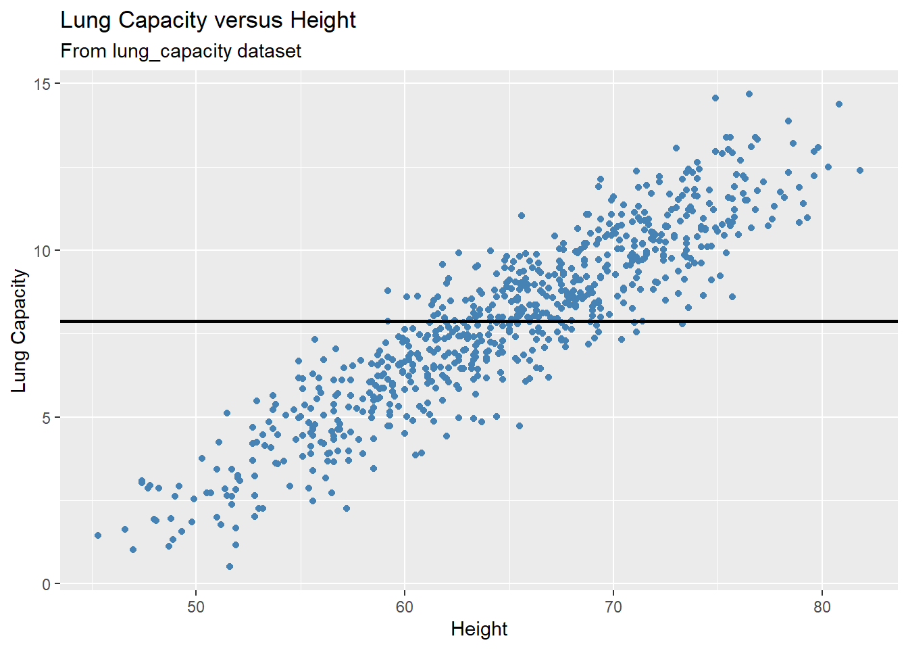
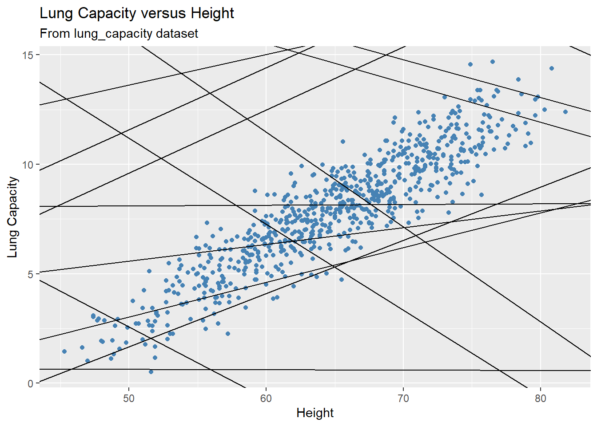
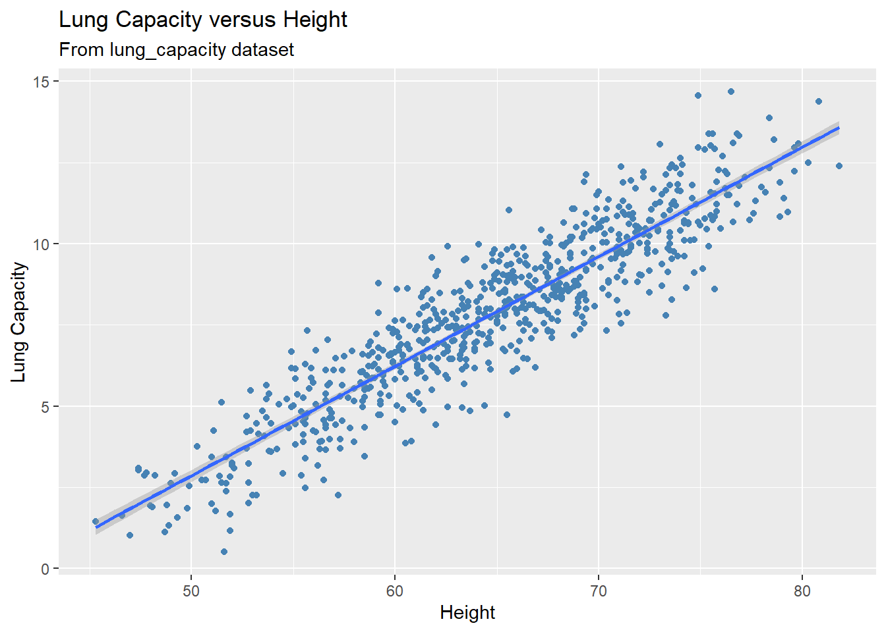

# Module 14 {-} 

&nbsp;

## Modeling {-}

### Introduction {-}


Patterns in your data provide clues about relationships among variables. If a systematic relationship exists between two variables it will appear as a pattern in the data. If you spot a pattern, ask yourself:

* Could this pattern be due to coincidence (i.e. random chance)?
* How can you describe the relationship implied by the pattern?
* How strong is the relationship implied by the pattern?
* What other variables might affect the relationship?
* Does the relationship change if you look at individual subgroups of the data?

Patterns provide one of the most useful tools for data analysts because they reveal **covariation**. If you think of **variation** as a phenomenon that creates uncertainty, **covariation** is a phenomenon that reduces it. If two variables covary, you can use the values of one variable to make better predictions about the values of the second. If the covariation is due to a causal relationship (a special case), then you can use the value of one variable to control the value of the second.

**Models** are a tool for extracting patterns out of data. The goal of a model is to provide a simple low-dimensional summary of a dataset. Ideally, the model will capture true “signals” (i.e. patterns generated by the phenomenon of interest), and ignore “noise” (i.e. random variation that you’re not interested in).

In this module, we only cover **predictive models**, which, as the name suggests, generate predictions. Specifically, we are going to focus on linear regression models, which are the most famous and arguably the simplest models, but yet they are widely used in all of statistics.  

&nbsp;

### Simple Linear Regression (SLR) Model {-}

As mentioned, a **linear regression model** is one of the simplest models for doing data analysis. Though it may seem somewhat dull compared to some of the more modern statistical learning approaches, linear regression is still a useful and widely applied statistical learning method. 

Moreover, it serves as a good starting point for more advanced approaches; in fact, many of the more sophisticated statistical learning approaches can be seen as generalizations to or extensions of ordinary linear regression. Consequently, it is important to have a good understanding of linear regression before studying more complex learning methods.

Before discussing linear regression models more in detail, we will first give its general definition. We will start off with a **simple linear regression (SLR) model**, a linear model that contains only one predictor.

#### Model Set Up {-}

A simple linear regression model defines a relationship between two variables as follows:

&nbsp;

\begin{align*}
Y_i = \beta_0 + \beta_1 X_i + \epsilon_i \quad  for  \quad  i = 1, \dots, n
\end{align*}

&nbsp;

where

* $Y$ is the **response** (also known as **target**, **outcome**, and **dependent**) variable
* $X$ is the **predictor** (also known as **explanatory** and **independent**) variable and its values are **fixed**
* $\beta_0$ and $\beta_1$ are the **fixed model parameters**; specifically, an **intercept** and **slope** of the regression function, respectively
* $\epsilon$ (epsilon) is an error term and it's a **random variable**; it is assumed to be normally distributed with mean 0 and variance $\sigma^2$, that is, $\epsilon \sim N(0, \sigma^2)$. 

&nbsp;

This model is **linear**, because it uses a linear function to describe a relationship between the response and predictor variables. And it is **simple**, because it contains only one predictor.

&nbsp;

**Interpretation of parameters:** 

The slope parameter $\beta_1$ indicates the change in the mean value of response variable $Y$ per unit increase in the predictor variable $X$.

The intercept parameter $\beta_0$ is the $Y$ intercept of the regression line. When the scope of the model includes $X = 0$, then $\beta_0$ given the mean value of $Y$ at $X = 0$.

&nbsp;

**Model Assumptions:**

Linear regression models must meet certain assumptions to be valid. These assumptions are

* Linearity of the regression function
* Constant variance of the error terms
* Independence of the error terms
* No outliers
* Normality of the error terms

&nbsp;

If we assume that the relationship between variables can be described using the SLR model, then this model can be utilized to make predictions about the response variable $Y$ based on the values of the predictor variable $X$.

Normally, we make predictions about the mean value of the response variable. In other words, using the predictive models such as SLR, we predict what the average value of the response value would be for a given value of the explanatory variable. It can be written as

&nbsp;

\begin{align*}
E(Y_i) = E(\beta_0 + \beta_1 X_i + \epsilon_i) = \beta_0 + \beta_1 X_i + 0  = \beta_0 + \beta_1 X_i 
\end{align*}

Thus,

\begin{align*}
E(Y_i) = \beta_0 + \beta_1 X_i  \quad  for  \quad  i = 1, \dots, n
\end{align*}

&nbsp;

As you noticed, SLR model contains three parameters: $\beta_0$, $\beta_1$, and $\sigma^2$. These parameters are fixed (they are constant), but their are **unknown** to us. Thus, we first need to estimate these parameters in order to set up a model and make predictions based on this model.

&nbsp;

#### Parameter Estimation: Least Squares Approach {-}

Before we introduce the estimation method, let's consider an example. Recall the lung capacity dataset that we've used in other modules. Suppose you believe that an SLR model can be used to predict _lung capacity_ based on patient's _height_. As adviced earlier, it is always a good idea to visualize your data as a part of EDA (Explanatory Data Analysis):


```r

 gg = ggplot(data = dataset1, aes(x = Height, y = LungCap)) + 
  
  geom_point(color = "steelblue") +
  
  labs(title = "Lung Capacity versus Height",
       
       subtitle = "From lung_capacity dataset",
       
       x = "Height",
       
       y = "Lung Capacity")


plot(gg)
```


From the scatterplot it becomes clear that a linear model will indeed be a good fit to our data as it displays a strong linear pattern/trend. Now it's time to estimate the parameters and set up the model. 

But how can we estimate these parameters? In general, our goal is to build a predictive model (known as a **fitted model**) of the form

&nbsp;

\begin{align*}
\hat{Y} = b_0 + b_1X
\end{align*}

&nbsp;

where $b_0$ and $b_1$ are the estimates of the model parameters $\beta_0$ and $\beta_1$, respectively, and $\hat{Y}$ is the **fitted value** of the response variable. There are infinite number of combinations of $b_0$ and $b_1$ values. And these combinations define a family of predictive models.

Let's plot some of them. For example, we could try to model the data with a horizontal line representing the mean value of the _lung capacity_ variable. That is, we are building a model where the response outcome does not depend on the predictor variable:


```r

mean_lungcap = mean(dataset1$LungCap)


gg + 

geom_hline(yintercept = mean_lungcap, size = 1)
```



In the plot above, we see this doesn’t seem to do a very good job. Many of the data points are very far from the line representing the mean value of the response variable. This is an example of **underfitting**. The obvious fix is to make the fitted model actually depend on the predictor. Below we illustrate a few of these models: 


```r

set.seed(4)
models <- tibble(
  b0 = runif(250, -20, 40),
  b1 = runif(250, -5, 5)
)


gg +
  
geom_abline(aes(intercept = b0, slope = b1), data = models)
```




Each line on the plot represents a fitted model. There are 250 models on the plot (not all of them are depicted on the plot). Most of these models are really bad! But how are we going to decide which one is the best? And what should be the selection criterion?

We need to find the good models by making precise our intuition that a good model is “close” to the data. We need a way to quantify the distance between the data and a model. Then we can fit the model by finding the value of $b_0$ and $b_1$ that generate the model with the smallest distance from this data.

One easy place to start is to find the vertical distance between each point and the model. This distance is just the difference between the fitted value (predicted) given by the model and the actual response value in the data:

\begin{align*}
Y_i - \hat{Y}_i
\end{align*}


```
#> `geom_smooth()` using formula 'y ~ x'
```


Next, we need some way to compute an overall distance between the predicted and actual values. One common way to do this in statistics is to use the sum of squared deviations (also known as **Error Sum of Squares (SSE)**). We compute the difference between actual and predicted, square them, and add them up:

&nbsp;

\begin{align*}
SSE = \sum_{i = 1}^{n}(Y_i - \hat{Y}_i)^2 = \sum_{i = 1}^{n}(Y_i - (b_0 + b_1X_i))^2
\end{align*}

&nbsp;

This distance has lots of appealing mathematical properties, which we’re not going to talk about here.

Now a pair of values $b_0$ and $b_1$ that minimize the quantity given above are known to be the best estimates of the model parameters $\beta_0$ and $\beta_1$. This approach is known as the **least squares method**, the estimates are called **least squares estimates**, and the fitted model is referred to as **ordinary least squares (OLS) regression**. 

We will skip the derivation of these estimates as it is beyond the scope of this bootcamp and simply provide formulas:

&nbsp;

\begin{align*}
b_1 = \frac{\sum_{i = 1}^{n}(x_i - \bar{x})(y_i - \bar{y})}{\sum_{i = 1}^{n}(x_i - \bar{x})^2}
\end{align*}

&nbsp;

\begin{align*}
b_0 = \bar{y} - b_1\bar{x}
\end{align*}

&nbsp;

Now when we know the best estimates of the model parameters, let's calculate their values. First, we will do it manually using the formulas:


```r

x <- dataset1$Height

y <- dataset1$LungCap

Sxy <- sum((x - mean(x)) * (y - mean(y)))

Sxx <- sum((x - mean(x)) ^ 2)

Syy <- sum((y - mean(y)) ^ 2)

b_1 <- Sxy / Sxx

print(b_1)
#> [1] 0.3371566

b_0 <- mean(y) - b_1 * mean(x)

print(b_0)
#> [1] -13.99683
```

Thus, a fitted function for our fitted model is given by

&nbsp;

\begin{align*}
\hat{Y} = -13.996 + 0.337 X
\end{align*}


Or, specifically 


\begin{align*}
\hat{Lung Capacity} = -13.996 + 0.337 Height
\end{align*}

&nbsp;

We can interpret the model estimates as follows:

We can expect the mean value of `lung capacity` to increase by 0.337 units per unit increase in the `Height` predictor.

In given context, it makes no sense to interpret the intercept as the scope of the model does not include $X = 0$ (you cannot have a patient with `Height = 0`).


Now, instead of doing calculations manually we can use the `lm()` function:


```r

model <- lm(LungCap ~ Height, data = dataset1)

summary(model)
#> 
#> Call:
#> lm(formula = LungCap ~ Height, data = dataset1)
#> 
#> Residuals:
#>     Min      1Q  Median      3Q     Max 
#> -3.3619 -0.7014 -0.0032  0.7787  3.2938 
#> 
#> Coefficients:
#>               Estimate Std. Error t value Pr(>|t|)    
#> (Intercept) -13.996829   0.367451  -38.09   <2e-16 ***
#> Height        0.337157   0.005633   59.86   <2e-16 ***
#> ---
#> Signif. codes:  
#> 0 '***' 0.001 '**' 0.01 '*' 0.05 '.' 0.1 ' ' 1
#> 
#> Residual standard error: 1.092 on 723 degrees of freedom
#> Multiple R-squared:  0.8321,	Adjusted R-squared:  0.8319 
#> F-statistic:  3583 on 1 and 723 DF,  p-value: < 2.2e-16
```

The `summary()` function provides a model summary (we will come back to it shortly).

Now we can visualize our results and plot the fitted regression line:


```r

gg +
  
  geom_smooth(method = 'lm')
#> `geom_smooth()` using formula 'y ~ x'
```



Set `se = FALSE` if you want to remove the confidence band around the regression line:


```r

gg +
  
  geom_smooth(method = 'lm', se = FALSE)
#> `geom_smooth()` using formula 'y ~ x'
```


&nbsp;

#### Making Predictions {-}

We can now utilize our fitted model to make predictions. Once again, we first do it manually, then present an R function. Suppose based on the fitted model you want to predict what would the mean lung capacity be for a patient with $Height = 75$?

To do so, we simply plug this value into the model and calculate the corresponding predicted value:

\begin{align*}
\hat{Lung Capacity} = -13.996 + 0.337 Height = -13.996 + 0.337\times 75 = 11.289
\end{align*}

Thus, the expected lung capacity for a patient with `Height = 75` is 11.289. Most of the time, you will want to make predictions for multiple values, and the number of inputs might be quite large. So instead of doing it manually, you can use the `predict()` function. You need to pass the fitted model object to the function and values of the predictor variable that you are trying to make predictions for: 
 

```r

predict(model, data.frame(Height = 75))
#>        1 
#> 11.28991
```


You can even make predictions for multiple values. For example let's calculate the expected mean lung capacity for `Height = 67.5`, `Height = 64`, and `Height = 53.8`:


```r

predict(model, data.frame(Height = c(67.5, 64, 53.8)))
#>        1        2        3 
#> 8.761240 7.581192 4.142195
```


`predict()` function can also be used to construct confidence interval. We will come back to this function later. 

&nbsp;

#### Residuals {-}

If we think of our model as “Response = Prediction + Error,” we can then write it as

&nbsp;

\begin{align*}
Y = \hat{Y} + e
\end{align*}


We then define a **residual** to be the observed value minus the predicted value:

&nbsp;

\begin{align*}
e = Y - \hat{Y}
\end{align*}


Residuals play a crucial role in a model building process and they are used in many statistical procedures. To obtained residuals for your data, use `residuals()` function (we will display the first 10 residuals as the dataset is large and displaying all residuals will take up much space):


```r

# Obtaining first 10 residuals

residuals(model)[1:10]  
#>           1           2           3           4           5 
#> -0.46559420 -1.06376699  0.04701586  1.18371232 -0.38738003 
#>           6           7           8           9          10 
#>  0.43073814 -2.39518208 -2.41399374 -0.89770940  0.83715986
```

It is a good idea to bind together the residuals and the predictor variable in one data frame so that you know what residual corresponds to what predictor value (values of the independent variable, **not predictions!**):


```r

# Obtaining first 10 residuals and corresponding predictor values

data.frame(Height = dataset1$Height, Residuals = residuals(model))[1:10, ]
#>    Height   Residuals
#> 1    62.1 -0.46559420
#> 2    74.7 -1.06376699
#> 3    69.7  0.04701586
#> 4    71.0  1.18371232
#> 5    56.9 -0.38738003
#> 6    58.7  0.43073814
#> 7    63.3 -2.39518208
#> 8    70.4 -2.41399374
#> 9    70.5 -0.89770940
#> 10   59.2  0.83715986
```


One of the main properties of residuals is that their summation is equal to zero. This property is used to derive some other important features of linear regression models. Let's show that the residuals for our model indeed add up to zero:


```r

sum(residuals(model))
#> [1] -1.496546e-14
```

&nbsp;

#### Variance Estimation {-}

We will now use the residuals to estimate the model variance, $\sigma^2$. The best estimate of the model variance $\sigma^2$ (derivations once again are omitted) is the **Error Mean Square (MSE)** given by

&nbsp;

\begin{align*}
MSE = \frac{\sum_{i = 1}^{n}(Y_i - \hat{Y}_i)^2}{n-2} = \frac{SSE}{n-2} = \frac{\sum Residuals^2}{n-2}
\end{align*}

&nbsp;

Let's estimate the model variance based on our data. First, let's do it manually:


```r

sum(residuals(model)^2)/(dim(dataset1)[1]-2)
#> [1] 1.191535
```


The output of the `anova()` function includes MSE, that is, an estimate of the model variance. Thus, it can be used for variance estimation:


```r

anova(model)
#> Analysis of Variance Table
#> 
#> Response: LungCap
#>            Df Sum Sq Mean Sq F value    Pr(>F)    
#> Height      1 4269.0  4269.0  3582.8 < 2.2e-16 ***
#> Residuals 723  861.5     1.2                      
#> ---
#> Signif. codes:  
#> 0 '***' 0.001 '**' 0.01 '*' 0.05 '.' 0.1 ' ' 1
```

In this output the value in the intersection of the `Mean.Sq` column and the `Residuals` row is MSE. Here, it is equal to 1.2.

&nbsp;

#### lm(): Useful Functions {-}

In this section I would like to share with you some useful functions that will allow you extract important information/features from your fitted model.


**summary()**

`summary()` function, as you've already seen, summarizes the fitted model:


```r

summary(model)
#> 
#> Call:
#> lm(formula = LungCap ~ Height, data = dataset1)
#> 
#> Residuals:
#>     Min      1Q  Median      3Q     Max 
#> -3.3619 -0.7014 -0.0032  0.7787  3.2938 
#> 
#> Coefficients:
#>               Estimate Std. Error t value Pr(>|t|)    
#> (Intercept) -13.996829   0.367451  -38.09   <2e-16 ***
#> Height        0.337157   0.005633   59.86   <2e-16 ***
#> ---
#> Signif. codes:  
#> 0 '***' 0.001 '**' 0.01 '*' 0.05 '.' 0.1 ' ' 1
#> 
#> Residual standard error: 1.092 on 723 degrees of freedom
#> Multiple R-squared:  0.8321,	Adjusted R-squared:  0.8319 
#> F-statistic:  3583 on 1 and 723 DF,  p-value: < 2.2e-16
```

It contains all sorts of information presented in one output. We will discuss them more in detail later on.


**coef()**

If your goal is to extract just the model coefficients (estimates), then use the `coef()` function:


```r

coef(model)
#> (Intercept)      Height 
#> -13.9968289   0.3371566
```


**resid()**

The `resid()` function is the same as the `residuals()` functions and displays residuals for the fitted model:


```r

# Obtaining residuals for the first 10 observations in the dataset

resid(model)[1:10]
#>           1           2           3           4           5 
#> -0.46559420 -1.06376699  0.04701586  1.18371232 -0.38738003 
#>           6           7           8           9          10 
#>  0.43073814 -2.39518208 -2.41399374 -0.89770940  0.83715986
```


**fitted()**

The `fitted()` function is used to obtain the fitted values:


```r

# Obtaining fitted values for the first 10 observations in the dataset

fitted(model)[1:10]
#>         1         2         3         4         5         6 
#>  6.940594 11.188767  9.502984  9.941288  5.187380  5.794262 
#>         7         8         9        10 
#>  7.345182  9.738994  9.772709  5.962840
```


As you understand, there is relationship among the actual response values, fitted values, and the residuals:


```r

actual <- dataset1$LungCap[1:10]

fitted <- fitted(model)[1:10]

residuals <- resid(model)[1:10]


data.frame(residuals, actual - fitted)
#>      residuals actual...fitted
#> 1  -0.46559420     -0.46559420
#> 2  -1.06376699     -1.06376699
#> 3   0.04701586      0.04701586
#> 4   1.18371232      1.18371232
#> 5  -0.38738003     -0.38738003
#> 6   0.43073814      0.43073814
#> 7  -2.39518208     -2.39518208
#> 8  -2.41399374     -2.41399374
#> 9  -0.89770940     -0.89770940
#> 10  0.83715986      0.83715986
```

&nbsp;

#### Confidence interval for $\beta_{1}$ {-}

For illustrative purposes, we will be using the Muscle Mass data set (available on Courseworks): 

A person's muscle mass is expected to decrease with age. To explore this relationship in women, a nutritionist randomly selected 15 women from each 10-year age group, beginning with age 40 and ending with age 79. She recorded their Age (predictor) and a measure of muscle mass (MM, response).


Now let's run a simple linear regression model. You can use "lm()" function:


```r

model = lm(MM ~ Age, data = mydata)
```

To check the summary of the model, use "summary()" function:


```r
summary(model)
#> 
#> Call:
#> lm(formula = MM ~ Age, data = mydata)
#> 
#> Residuals:
#>      Min       1Q   Median       3Q      Max 
#> -16.1368  -6.1968  -0.5969   6.7607  23.4731 
#> 
#> Coefficients:
#>             Estimate Std. Error t value Pr(>|t|)    
#> (Intercept) 156.3466     5.5123   28.36   <2e-16 ***
#> Age          -1.1900     0.0902  -13.19   <2e-16 ***
#> ---
#> Signif. codes:  
#> 0 '***' 0.001 '**' 0.01 '*' 0.05 '.' 0.1 ' ' 1
#> 
#> Residual standard error: 8.173 on 58 degrees of freedom
#> Multiple R-squared:  0.7501,	Adjusted R-squared:  0.7458 
#> F-statistic: 174.1 on 1 and 58 DF,  p-value: < 2.2e-16
```

The estimates of the model parameters can be found under "Coefficients" in the "Estimate" column. For example, the estimate of the slope, that is, the estimated coefficient associated with the "Age" predictor is equal to  -1.19. Similarly, the estimate of the intercept is 156.3466.

You can construct a confidence interval and test hypothesis regarding the $\beta_{1}$ by either using R functions or doing it manually. We will consider both ways. Let's start with R codes.

To find a confidence interval for the slope, given $\alpha = 0.05$ significance level, use the following function:


```r
confint(model, "Age", level = 0.95)
#>         2.5 %    97.5 %
#> Age -1.370545 -1.009446
```

You can observe that this function computes lower and upper bounds of the confidence interval for the specified level of significance $\alpha$. The function has three arguments: first is the model name (whatever name you give to your model), the predictor's name, and the confidence level).

Now, let's do it manually. A confidence interval for the slope can be computed by


\begin{align*}
b_{1} \pm t(1-\alpha/2; n-2) \times s(b_{1})
\end{align*}


We found that the estimate of the slope is $b_{1}  = -1.19$. $s(b_{1})$ is the standard error of the estimate and can be found in the model summary under "Coefficients" in the "Std. Error" column. For this example $s(b_{1}) = 0.0902$. Finally, for $\alpha = 0.05$, $t(1-\alpha/2; n-2) = t(0.975; 58)$ and can be found by


```r
qt(0.975, 58)
#> [1] 2.001717
```

So putting everything together we get

\begin{align*}
-1.19 \pm 2.0017 \times 0.0902 
\end{align*}

&nbsp;

#### Testing $H_{0}: \beta_{1} = 0  \quad vs \quad H_{a}: \beta_{1} \neq 0$ via t-test {-}


Now let's perform hypothesis testing concerning the following hypotheses:

\begin{align*}
H_{0}: \beta_{1} = 0  \quad vs \quad H_{a}: \beta_{1} \neq 0
\end{align*}


First let's do it by performing t-test. The easiest way is to just check the summary output of the model: here the test statistic $t^{*}$ can be found under "Coefficients" in the "t value" column. It is -13.19 for our case. Then the corresponding P-value is given at the intersection of "Pr(>|t|)" column and "Age" row, and it is 0 for our example (basically, <2e-16 is a very very small number and can be treated as 0). So based on this P-value you can make a conclusion about the significance of the predictor.

We can perform the same procedure manually. To do so, let's consider another example. Suppose you want to test the following hypothesis:


\begin{align*}
H_{0}: \beta_{1} = 2  \quad vs \quad H_{a}: \beta_{1} \neq 2
\end{align*}


First let's find the the test statistic $t^{*}$:

\begin{align*}
t^{*} = \frac{b_{1} - 2}{s(b_{1})}
\end{align*}

For our example it is $t^{*} = \frac{-1.19 - 2}{0.0902} = -35.3656$. As we know $t^{*} \sim t(n-2)$. Then the corresponding P-value can be computed by finding the probability of two tails beyond $\pm|t^{*}|$. So


```r

2*(1-pt(35.3656, 58))
#> [1] 0
```
As you can see we get the same result as reported in the table. Note, for one-sided test, you don't multiply the quatity by 2 and you have to pick the side that corresponds to your hypothesis.

&nbsp;

#### Testing $H_{0}: \beta_{1} = 0  \quad vs \quad H_{a}: \beta_{1} \neq 0$ via F-test {-}

Now let's consider another way of testing $H_{0}: \beta_{1} = 0  \quad vs \quad H_{a}: \beta_{1} \neq 0$, which is F-test. To do so, let's obtain an ANOVA table:


```r

anova(model)
#> Analysis of Variance Table
#> 
#> Response: MM
#>           Df  Sum Sq Mean Sq F value    Pr(>F)    
#> Age        1 11627.5 11627.5  174.06 < 2.2e-16 ***
#> Residuals 58  3874.4    66.8                      
#> ---
#> Signif. codes:  
#> 0 '***' 0.001 '**' 0.01 '*' 0.05 '.' 0.1 ' ' 1
```

The output above helps you set up the anova table: it provides values of degrees of freedom, sum of squares, and mean sum of squares for Regression (stated as Age in the table) and error (stated as residuals). 

Anova table also provides a test statistic for the F-test, which is 174.06 (check whether it is indeed equal to MSR/MSE) and is given in the "F value" column. Then the corresponding P-value will be provided in the "Pr(>F)" column and is 0. 


#### Confidence interval for mean response {-}

Now we will construct a 95% confidence interval for the mean muscle mass of women at age of 20. To do so, use the following formula:


```r

predict(model, data.frame(Age = 20), interval = "confidence", level = 0.95)
#>        fit     lwr      upr
#> 1 132.5467 125.025 140.0683
```

The output above gives an estimate of the mean response (132.5467 in this case) and lower and upper boundaries for the confidence interval.

#### Prediction interval for mean response {-}


Similarly, we can find a prediction interval for the mean muscle mass for women at age of 20 (remember what is the difference between confidence and prediction intervals?). To do so, use the following formula:


```r

predict(model, data.frame(Age = 20), interval = "prediction", level = 0.95)
#>        fit      lwr      upr
#> 1 132.5467 114.5401 150.5532
```

**Note:** Many topics discussed in this module might be unfamiliar to you and that's ok. You will take a **STAT 5205: Linear Regression Models** class in the upcoming fall semester, where you will be exposed to these and other related topics more in detail. As of now, it is enough to know these basic R functions. 
