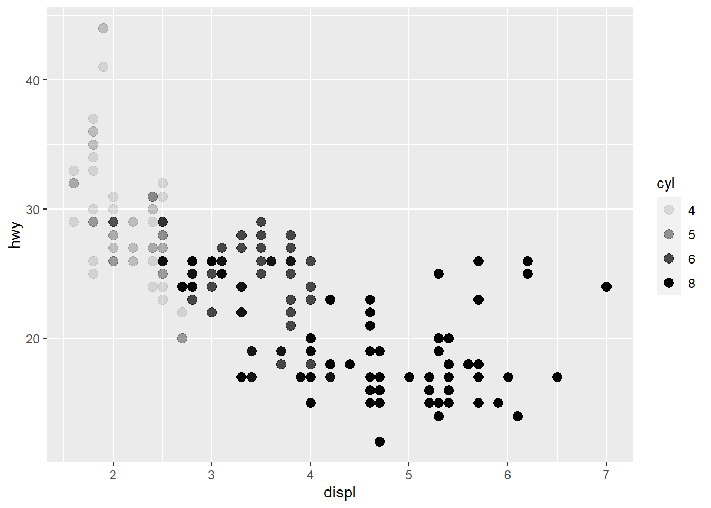
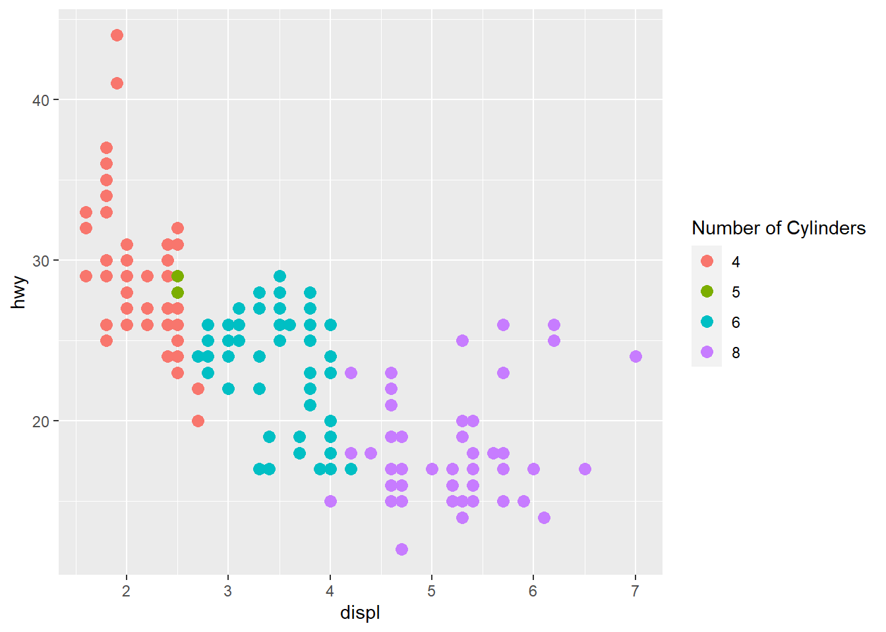
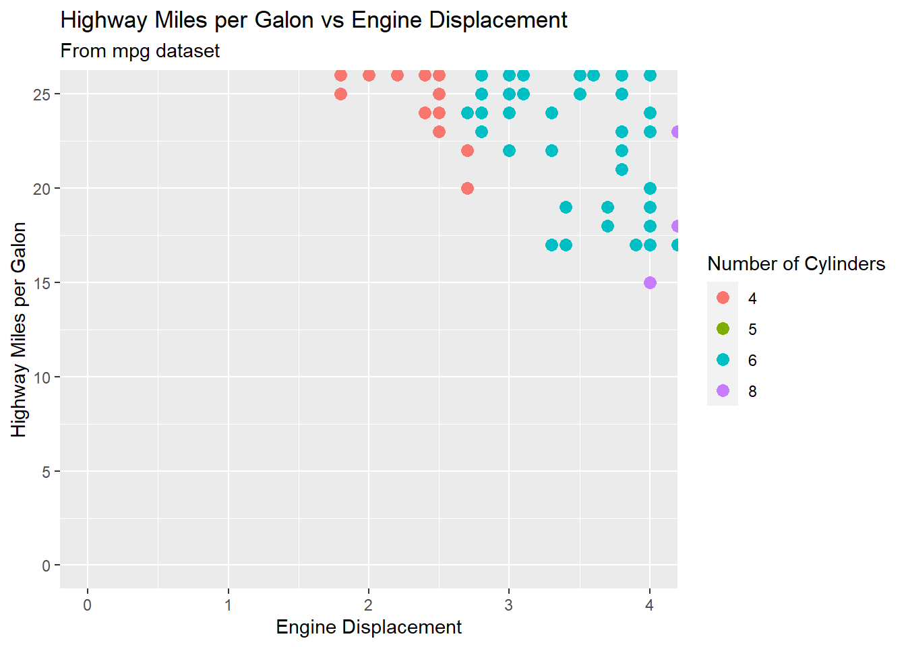
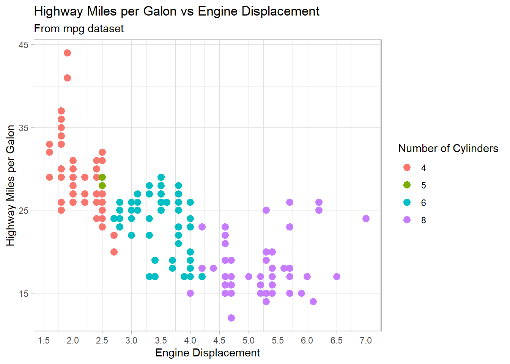
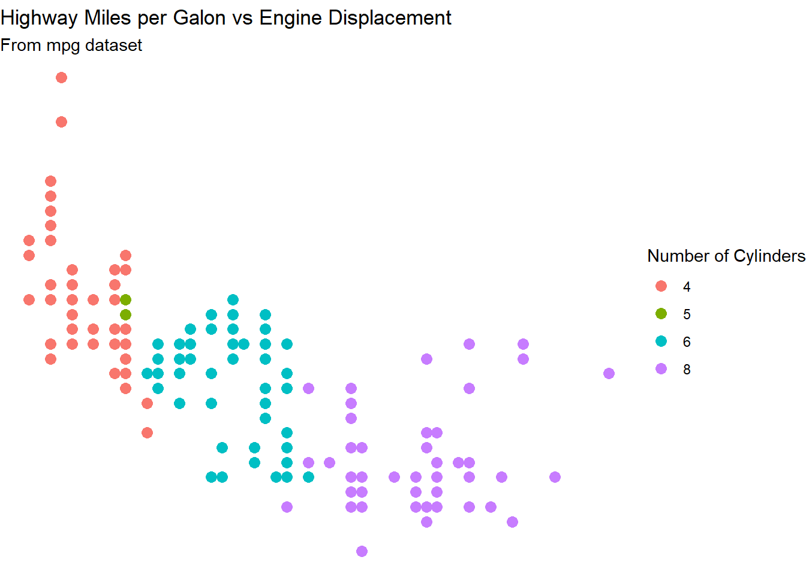
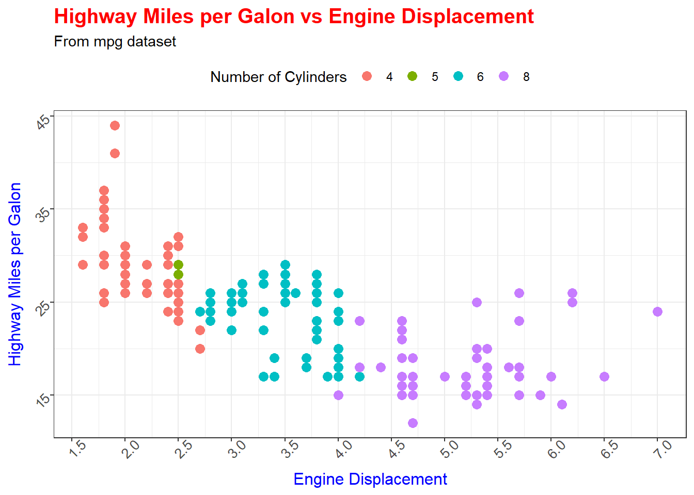

# Module 9 {-} 

&nbsp;

## ggplot2 Package {-}


We have already learned how to visualize data using `Base R`. In this (and the following) module(s) we are going to learn how to do it using `ggplot2` package. R has several systems for making graphs, but `ggplot2` is one of the most elegant and most versatile. `ggplot2` implements the grammar of graphics, a coherent system for describing and building graphs. With `ggplot2`, you can do more faster by learning one system and applying it in many places.


We will use `mpg` dataset to illustrate functionality of the `ggplot2` package. It contains a subset of the fuel economy data that the EPA makes available. It contains only models which had a new release every year between 1999 and 2008 - this was used as a proxy for the popularity of the car.


```r

print(mpg)
#> # A tibble: 234 × 11
#>    manufac…¹ model displ  year cyl   trans drv     cty   hwy
#>    <chr>     <chr> <dbl> <int> <fct> <chr> <chr> <int> <int>
#>  1 audi      a4      1.8  1999 4     auto… f        18    29
#>  2 audi      a4      1.8  1999 4     manu… f        21    29
#>  3 audi      a4      2    2008 4     manu… f        20    31
#>  4 audi      a4      2    2008 4     auto… f        21    30
#>  5 audi      a4      2.8  1999 6     auto… f        16    26
#>  6 audi      a4      2.8  1999 6     manu… f        18    26
#>  7 audi      a4      3.1  2008 6     auto… f        18    27
#>  8 audi      a4 q…   1.8  1999 4     manu… 4        18    26
#>  9 audi      a4 q…   1.8  1999 4     auto… 4        16    25
#> 10 audi      a4 q…   2    2008 4     manu… 4        20    28
#> # … with 224 more rows, 2 more variables: fl <chr>,
#> #   class <chr>, and abbreviated variable name
#> #   ¹​manufacturer
```

Among the variables in `mpg` are:

* `displ` - a car's engine size, in liters
* `hwy` - a car's fuel efficiency on the highway, in miles per gallon (mpg)
* `cyl` - number of cylinders
* `class` - type of a car
* `drv` - the type of drive train


Before we start exploring the `ggplot2` package, let's convert one of the variables into a factor:


```r

mpg$cyl <- as.factor(mpg$cyl)
```


### Creating a ggplot Object {-}

Every ggplot2 plot has three key components:

* **Data**
* A set of **aesthetic mappings** between variables in the data and visual properties
* At least one layer which describes how to render each observations. Layers are usually created with a **geom** function

To produce a scatterplot, you need to pass your data to `ggplot()` function:


```r

ggplot(data = mpg)
```


As you can notice, it creates a plot object but does not display data. To add datapoints to this object, we add a `geom_point()` function with a `+` sign and inside the function we specify `x` and `y` variables from the dataset, which will be `x` and `y` axes, respectively:


```r

  ggplot(data = mpg) + 
  
  geom_point(mapping = aes(x = displ, y = hwy))
```


Note that we’ve put each command on a new line. It is recommended doing this in your code, so it’s easy to scan a plot specification and see exactly what’s there.


### Changing the Color, Size, and Shape of Datapoints {-}

We can change the color, size, and shape of the datapoints by passing these arguments to the `geom_point()` function:


```r

  ggplot(data = mpg) + 
    
  geom_point(mapping = aes(x = displ, y = hwy),
               
               color = "steelblue",
               
               size = 3,
             
               shape = 24)
```


In this plot the color, size, and shape of points are static, meaning that they are the same for every point. If you want the color to change based on another variable in the dataset to reflect its categories, you need to specify this inside the `aes()` function:


```r

  ggplot(data = mpg) + 
    
    geom_point(mapping = aes(x = displ, y = hwy, color = cyl),
               
               size = 3) 
```


`ggplot2` automatically assigned colors to the levels of `cyl` variable. If you want to change them manually, you need to do so using `scale_colour_manual()` function:


```r

  ggplot(data = mpg) + 
    
    geom_point(mapping = aes(x = displ, y = hwy, color = cyl),
               
               size = 3) +
    
    scale_colour_manual(values = c(`4` = "red", 
                                   
                                   `5` = "blue",
                                   
                                   `6` = "orange", 
                                   
                                   `8` = "yellow"))
```


You can also change the shape of points to reflect another variable in the dataset:


```r

  ggplot(data = mpg) + 
    
    geom_point(mapping = aes(x = displ, y = hwy, color = cyl, shape = class),
               
               size = 3)
#> Warning: The shape palette can deal with a maximum of 6
#> discrete values because more than 6 becomes difficult
#> to discriminate; you have 7. Consider specifying
#> shapes manually if you must have them.
#> Warning: Removed 62 rows containing missing values
#> (geom_point).
```


Or you can do so by changing the transparency of the points:


```r

  ggplot(data = mpg) + 
    
    geom_point(mapping = aes(x = displ, y = hwy, alpha = cyl),
               
               size = 3)
#> Warning: Using alpha for a discrete variable is not advised.
```



To change the legend title, add `labs()` function and use `color` argument:


```r

  ggplot(data = mpg) + 
    
  geom_point(mapping = aes(x = displ, y = hwy, color = cyl),
               
               size = 3) +
    
  labs(color = "Number of Cylinders")
```




Let's save the ggplot object. We will be adding new layers to this object shortly:


```r

  gg <-   ggplot(data = mpg) + 
    
    geom_point(mapping = aes(x = displ, y = hwy, color = cyl),
               
               size = 3) +
    
    labs(color = "Number of Cylinders")
```


### Adding Labels {-}

To add labels to your ggplot object, you can use `labs()` function once again. Inside this function, you specify the plot title, subtitle, labels of `x` and `y` axes:


```r

gg <- gg +
  
  labs(title = "Highway Miles per Galon vs Engine Displacement",
       
       subtitle = "From mpg dataset",
       
       x = "Engine Displacement",
       
       y = "Highway Miles per Galon")


print(gg)
```


### Adjusting Limits of Axes {-}

The `x` and `y` axes limits can be controlled in 2 ways:

You can change the axis limits using `xlim()` and `ylim()` functions. You need to pass a numeric vector of length 2 (with max and min values) or just the max and min values:


```r

  gg +
  
  xlim(c(0, 4)) +
  
  ylim(c(0, 25))
#> Warning: Removed 170 rows containing missing values
#> (geom_point).
```


The limitation of this approach is that it deletes the points outside the specified range. The other approach is to change the `x` and `y` limits by zooming in to the region of interest without deleting points. It is achieved using the `coord_cartesian()` function:


```r

  gg +
  
  coord_cartesian(xlim = c(0, 4),
                  
                  ylim = c(0, 25))
```




There is a primary argument that affects the appearance of the ticks on the axes: `breaks`. Breaks controls the position of the ticks, or the values associated with the keys. You pass this argument to either `scale_x_continuous()` or `scale_y_continuous()` functions, depending which axis you want to modify:


```r

  gg <- gg +
    
    scale_x_continuous(breaks = seq(0, 8, 0.5)) +
    
    scale_y_continuous(breaks = seq(15, 50, 10))


print(gg)
```


### Themes {-}

You can customize the non-data elements of your plot with a `theme()` function. For example, you can change the background of the plot:


```r

  gg +
   
    theme_bw() 
```


```r

  gg +
   
    theme_classic() 
```


```r

  gg +
   
    theme_dark() 
```


```r

  gg +
   
    theme_light() 
```




```r

  gg +
   
    theme_linedraw() 
```


```r

  gg +
   
    theme_minimal() 
```


```r

  gg +
   
    theme_void() 
```




Let's select `theme_bw()` option and update our plot:


```r

  gg <- gg +
    
    theme_bw()
```

Further, we can change the color and size of titles, size and angle of ticks on axes, and the location of legends:


```r

  gg <- gg +
    
    theme(plot.title=element_text(size=15, face="bold", color = "red"),
             
             axis.text.x=element_text(size=10, angle = 45),
             
             axis.text.y=element_text(size=10, angle = 45),
             
             axis.title.x=element_text(size=12, color = "blue"),
             
             axis.title.y=element_text(size=12, color = "blue"),
          
             legend.position = "top") 

print(gg)
```




### Facets {-}

When working with categorical variables, it becomes particularly useful to split your plot into facets, subplots that each display one subset of the data that correspond to the level of the categorical variable. 


To facet your plot by a single variable, use the `facet_wrap()` function. The first argument of `facet_wrap()` should be a formula, which you create with `~` followed by a variable name (here “formula” is the name of a data structure in R, not a synonym for “equation”). The variable that you pass to `facet_wrap()` should be discrete. Let's plot `displ` against `hwy` for each level of the `class` variable separately:


```r

  ggplot(data = mpg) + 
    
  geom_point(mapping = aes(x = displ, y = hwy)) +
    
  facet_wrap(~ class)
```


You can decide how the plots should be displayed by specifying the number of rows in the final plot:


```r

  ggplot(data = mpg) + 
    
  geom_point(mapping = aes(x = displ, y = hwy)) +
    
  facet_wrap(~ class, nrow = 2)
```


To facet your plot on the combination of two variables, add `facet_grid()` to your plot call. Let's plot `displ` against `hwy` for different combinations of levels of the `class` and `drv` variables:


```r

  ggplot(data = mpg) + 
    
  geom_point(mapping = aes(x = displ, y = hwy)) +
    
  facet_grid(drv ~ class)
```


