# PS 3 Solutions {-}

&nbsp;

&nbsp;

## Problem 1 (Use Base R) {-}

1. Compare the average age of local population for the US and non-US stores by displaying their boxplots. Customize your boxplots as follows: add labels, change the colors, and add notches.


```r
data1 <- read.csv(file = "carseats.csv", header = T, stringsAsFactors = T)

boxplot(data1$Age ~ data1$US,
        
        xlab = "Store Loc.",
        
        ylab = "Age",
        
        names = c("Non-US", "US"),
        
        main = "Age of Population for the US and non-US stores",
        
        col = c("lightblue", "lightcoral"),
        
        border = c("dodgerblue", "red"),
        
        notch = T)
```

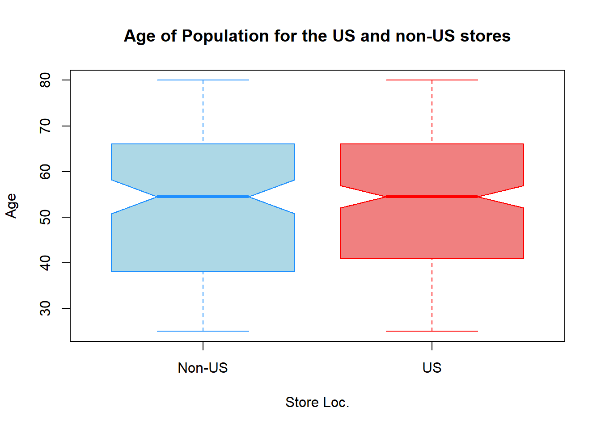

&nbsp;

2. Summarize the quality of shelving locations by displaying its barplot. Customize it as discussed in the previous question ( no notches here).


```r
barplot(table(data1$ShelveLoc),
        
        xlab = "Quality of Shelving Loc.",
        
        ylab = "Num. of Stores",
        
        main = "Quality of Shelving Loc. Count",
        
        col = "lightblue",
        
        border = "blue")
```

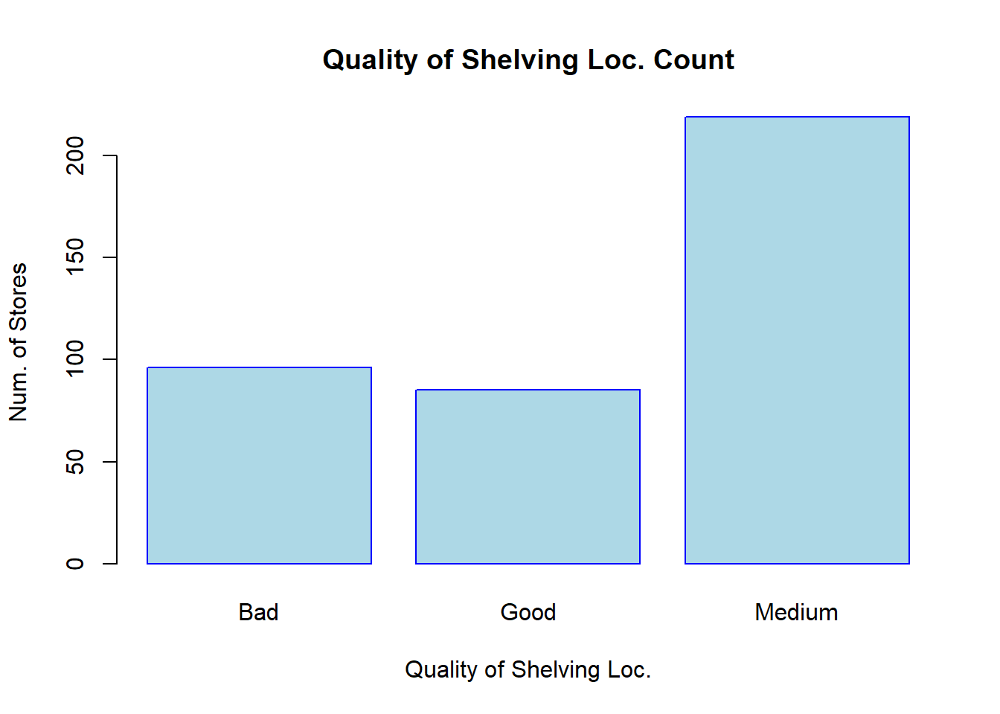

&nbsp;

3. Plot a side-by-side barplots displaying the frequency of `ShelveLoc` variable in urban and rural areas. Customize your plot as discussed above.


```r
barplot(table(data1[, c("ShelveLoc", "Urban")]),
        
        beside = TRUE,
        
        legend.text = c("Bad", "Good", "Medium"),
        
        ylab = "Num. of Stores",
        
        xlab = "Store Location: Urban",
        
        main = "Qual. of Shelving Loc. vs Urban/Rural",
        
        col = c("lightblue", "lightcoral", "orange"))
```

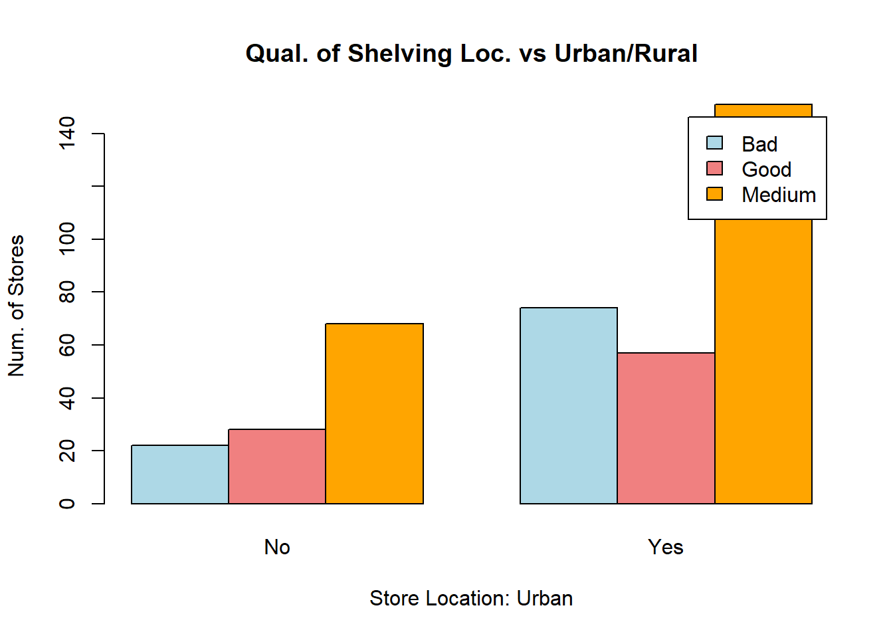

&nbsp;

4. Plot the `Sales` variable against the `Price` variable. Label the plot and axes accordingly, change the shape of points to triangular, change the color of points based on whether the store is located in urban (orange color) or rural (green color) area and add the corresponding legend to the plot, change the size of points to 0.9.


```r
colors <- c("green", "orange")

plot(x = data1$Price,
     
     y = data1$Sales,
     
     xlab = "Price",
     
     ylab = "Sales",
     
     main = "Sales vs Price",
     
     col = colors[data1$Urban],
     
     pch = 2,
     
     cex  = 0.9)


legend("topleft", legend = c("Rural", "Urban"), pch = 2, col = colors)
```

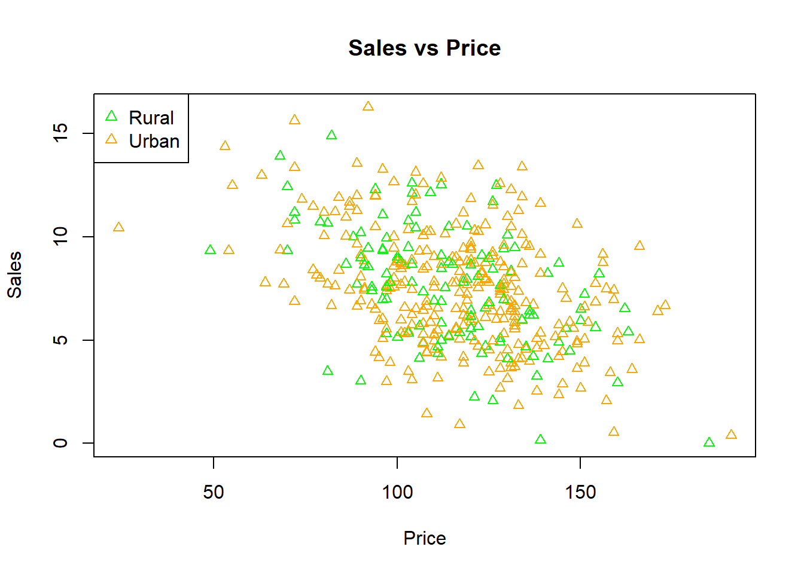

&nbsp;

5. Combine a histogram of the `Price` variable and a boxplot of the `Population` variable in one image. Customize both plots as discussed in part (1) (no notches for the histogram).


```r
par(mfrow = c(1, 2))

hist(data1$Price,
     
     xlab = "Price",
     
     ylab = "Num. of Stores",
     
     main = "Histogram of Price",
     
     col = "pink",
     
     border = "violetred")


boxplot(data1$Population,
        
        xlab = "Population",
        
        ylab = "Values",
        
        main = "Boxplot of Population",
        
        col = "lightblue",
        
        border = "dodgerblue")
```

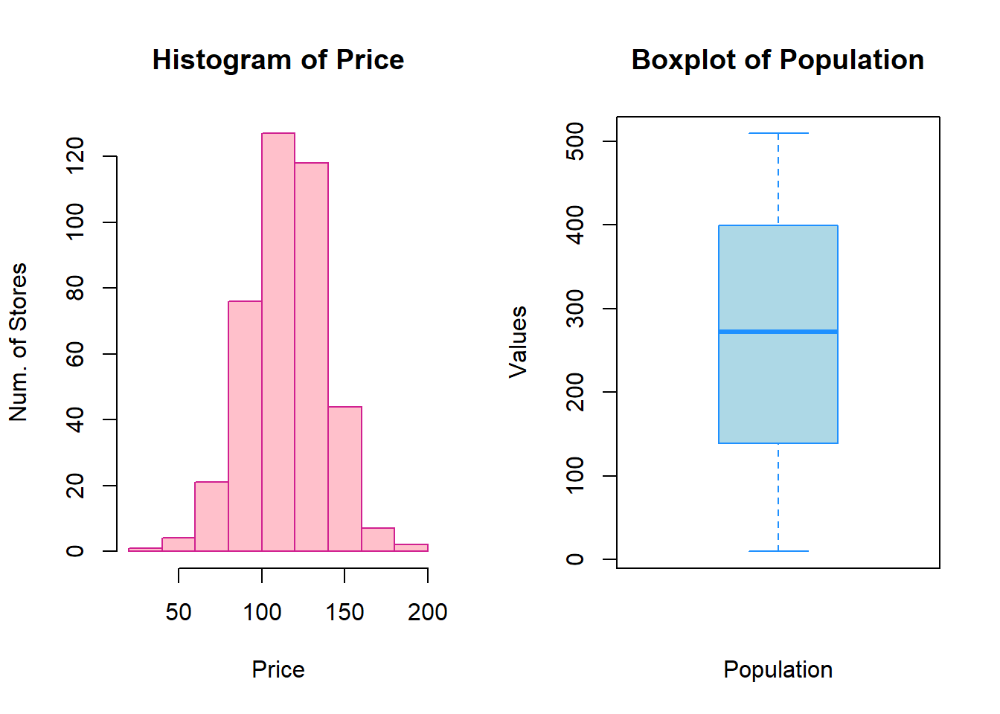


&nbsp;


## Problem 2 (Use ggplot2 Package) {-}

1. Plot a histogram of the `Sale_Price` variable: add labels (title, subtitle, x and y labels); adjust the limits of the x axis by adding new ticks to it (step size = 100,000) and changing the angle of ticks to 60; change the theme to minimal; change the colors of bins and bin outlines (it is up to you to pick colors); add a blue vertical line that represents the mean value of the variable. 


```r

data <- read.csv("ames_housing.csv", header = T, stringsAsFactors = TRUE)

library(tidyverse)
#> ── Attaching packages ─────────────────── tidyverse 1.3.2 ──
#> ✔ ggplot2 3.3.6      ✔ purrr   0.3.5 
#> ✔ tibble  3.1.8      ✔ dplyr   1.0.10
#> ✔ tidyr   1.2.1      ✔ stringr 1.4.1 
#> ✔ readr   2.1.3      ✔ forcats 0.5.2 
#> ── Conflicts ────────────────────── tidyverse_conflicts() ──
#> ✖ dplyr::filter() masks stats::filter()
#> ✖ dplyr::lag()    masks stats::lag()

ggplot(data = data) +
    
geom_histogram(aes(x = Sale_Price),
               
               fill="steelblue1",
               
               color="steelblue") +
  
  geom_vline(aes(xintercept = mean(Sale_Price)),
               
           color = "blue",
               
           size = 1) +

  labs(title = "Sale Price Histogram",
       
       subtitle = "From ames_housing dataset",
       
       x = "Sale Price",
       
       y = "Frequency") +
  
  scale_x_continuous(breaks = seq(0, 750000, 100000), limits = c(0, 750000)) +
  
  theme_minimal() +
  
  theme(axis.text.x=element_text(angle = 60))
#> `stat_bin()` using `bins = 30`. Pick better value with
#> `binwidth`.
#> Warning: Removed 1 rows containing non-finite values
#> (stat_bin).
#> Warning: Removed 2 rows containing missing values
#> (geom_bar).
```

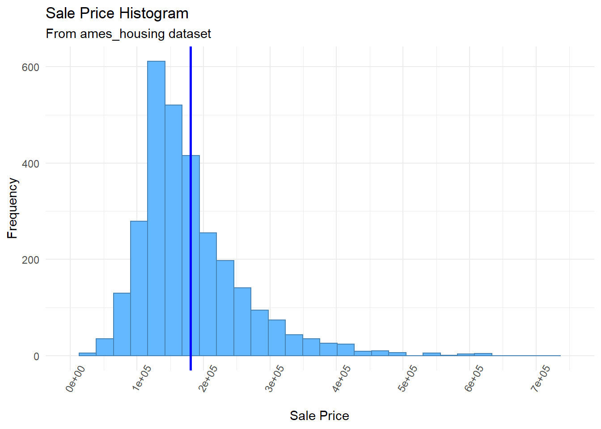

&nbsp;

2. Use a stacked barplot to visualize the relationship between these two categorical variables (make sure the bars have the same height); add labels to the plot (title, subtitle, x and y labels).


```r
ggplot(data = data) +
  
  geom_bar(mapping = aes(x = Roof_Style, fill = Fence),
           
           position = "fill") +
  
  labs(title="Distribution of Fence for Different Roof Style",
      
      subtitle="From ames_housing dataset",
      
      x="Roof Style",
      
      y="Frequentist Probability")
```

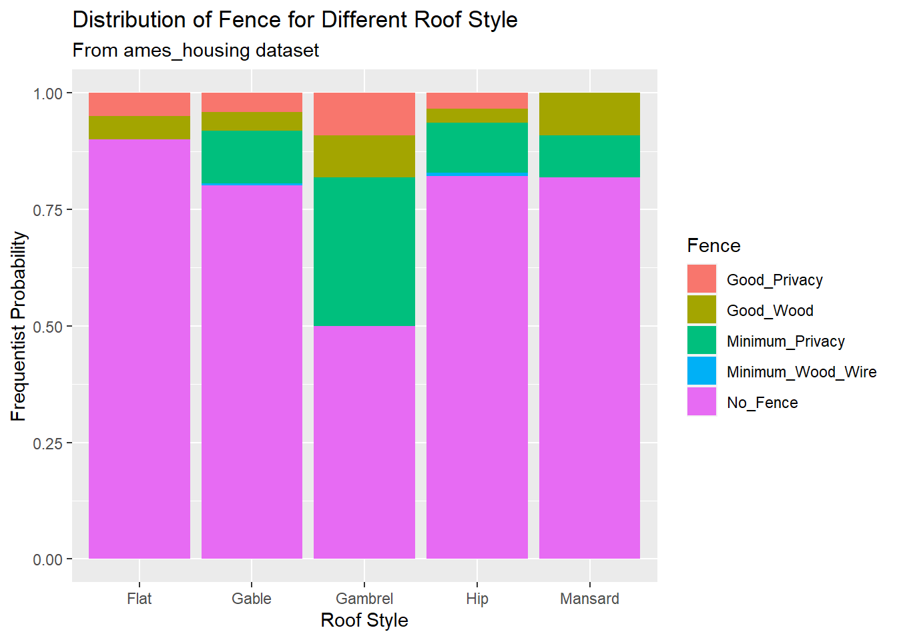

&nbsp;

3. Plot a boxplot of the `Sales_Price` variable reflecting the `North_Ames` and `College_Creek` neighborhoods; add black dots to these boxplots that represent the average prices in these groups; make boxplots transparent (use transparency rate of 0.45).


```r

data1 <- data %>% filter(Neighborhood %in% c("College_Creek", "North_Ames"))

ggplot(data = data1) +
  
geom_boxplot(aes(x = Neighborhood, y = Sale_Price), alpha = 0.45) +
  
stat_summary(aes(x = Neighborhood, y = Sale_Price),
               
             fun = "mean",
               
             geom = "point",
               
             color = "black")
```

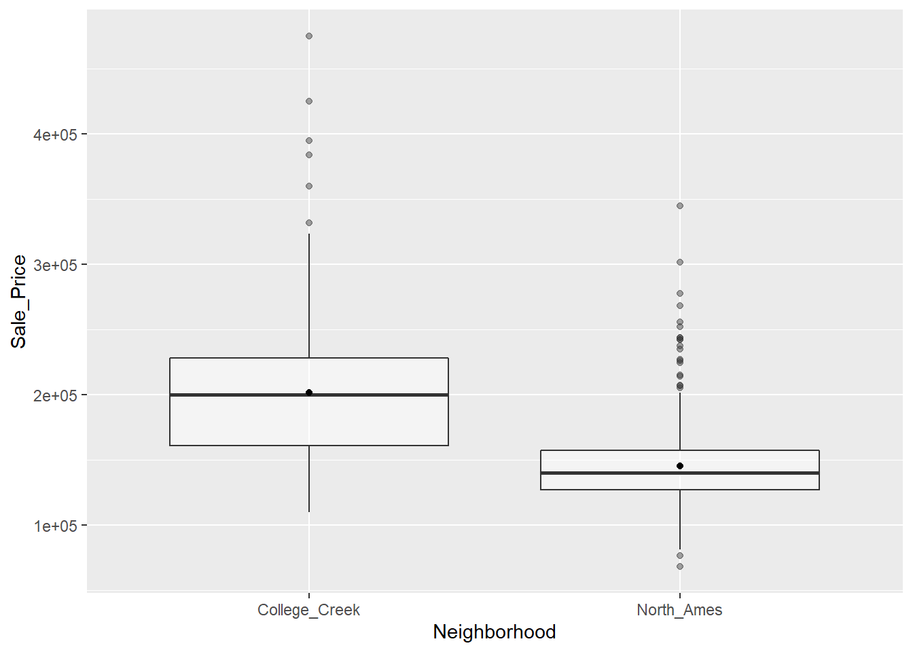

&nbsp;

4. Add a new variable to the dataset (name it `Rooms`) that will split all homes in the dataset into the following three groups based on the total number of rooms above the ground: `"2-4"`, `"5-8"`, and `"9 or more"`. In other words, you need to create a factor variable with 3 levels by converting the `TotRms_AbvGrd` variable. (Hint: you might want to check out the `case_when()` function from `dpyr` package).

   Plot a barplot of the `Rooms` variable: add labels to this barplot that display the exact frequency of each category. Plot another barplot of the `Rooms` variable with labels that display the frequency of each category as percentages. Now create a composition (assemble) of these plots (it is up to you to pick a layout). In other words, combine these barplots in one plot.
   

```r
categorize <- function(x) {
  
  case_when(x<=4 & x>=2 ~ "2-4",
            
            x<=8 & x>=5 ~ "5-8",
            
            x>=9 ~ "9 or more") %>%
    
  as.factor()
  
}

data <- data %>%
  
  mutate(Rooms = categorize(TotRms_AbvGrd))
```


```r
gg1 <- ggplot(data = data) +
  
  geom_bar(mapping = aes(x = Rooms), fill = "gray70") +
  
  geom_text(aes(x = Rooms, label = ..count..),
            
            stat = "count",
            
            colour = "black")

data2 <- data %>%
  
  count(Rooms) %>%
  
  mutate(perc = n / sum(n))

gg2 <- ggplot(data2, aes(x = Rooms, y = perc)) +
  
  geom_bar(stat = "identity", fill = "gray70") +
  ## add percentage labels
  
  geom_text(aes(label = scales::percent(perc))) +
  
  scale_y_continuous(labels = scales::percent) +
  
  labs(y = "Percentage")

library(patchwork)
#> Warning: package 'patchwork' was built under R version 4.2.3

gg1/gg2
```

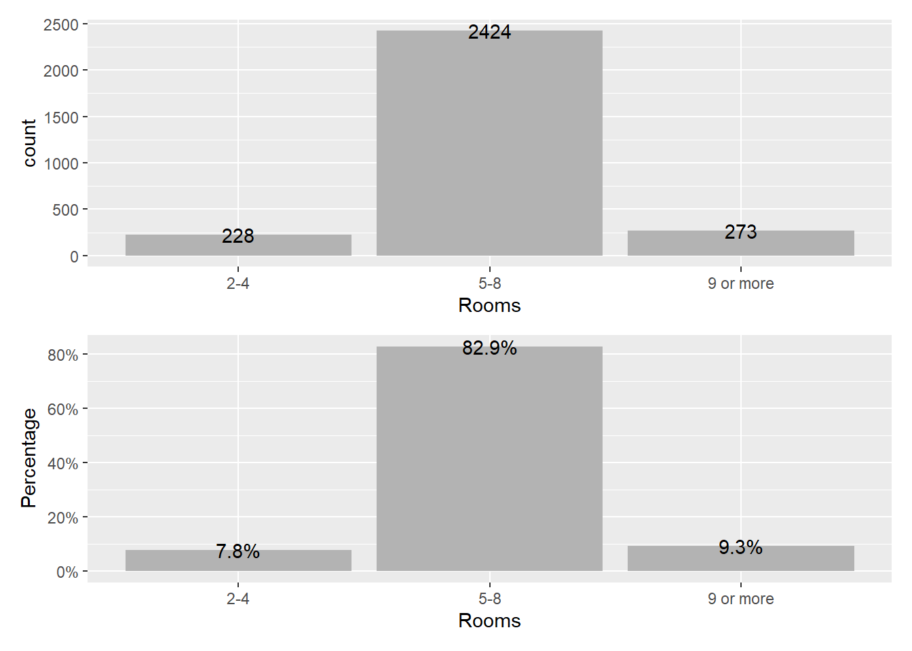


&nbsp;

5. Plot the `Sale_Price` variable (Y) against the `Gr_Liv_Area` variable (X): add labels to the scatterplot (title, subtitle, caption, x and y labels) and change their colors; change the size and shape of datapoints; change the color of datapoints based on the `Rooms` variable; move the legends to the left.


```r
  ggplot(data = data) + 
  
  geom_point(mapping = aes(x = Gr_Liv_Area, y = Sale_Price, color = Rooms),
               
             size = 0.8,
             
             shape = 22) +
  
  labs(x = "Above Ground Living Area",
       
       y = "Sale Price",
       
       title = "Sale Price - Above Ground Living Area Scatter Plot",
       
       subtitle = "From ames_housing data",
       
       caption = "The plot resembles a correlation between sale price and above ground living area.") +
  
  theme(plot.title=element_text(size=15, face="bold", color = "red"),
             
        axis.title.x=element_text(color = "blue"),
             
        axis.title.y=element_text(color = "blue"),
        
        legend.position = "left")
```

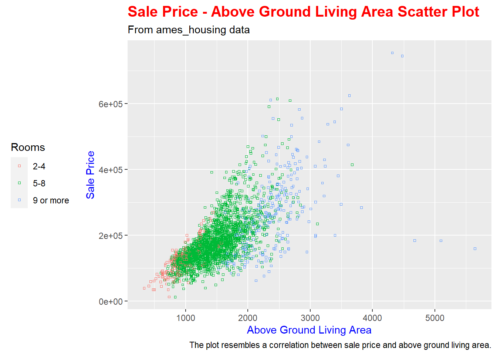

&nbsp;

6. Plot the `Sale_Price` variable (Y) against the `Gr_Liv_Area` variable (X) for each level of the `Rooms` variable separately, using facets. 


```r

ggplot(data = data) + 
    
  geom_point(mapping = aes(x = Gr_Liv_Area, y = Sale_Price),
             
             size = 0.8,
             
             shape = 22,
             
             color = "steelblue") +
    
  facet_wrap(~ Rooms)
```

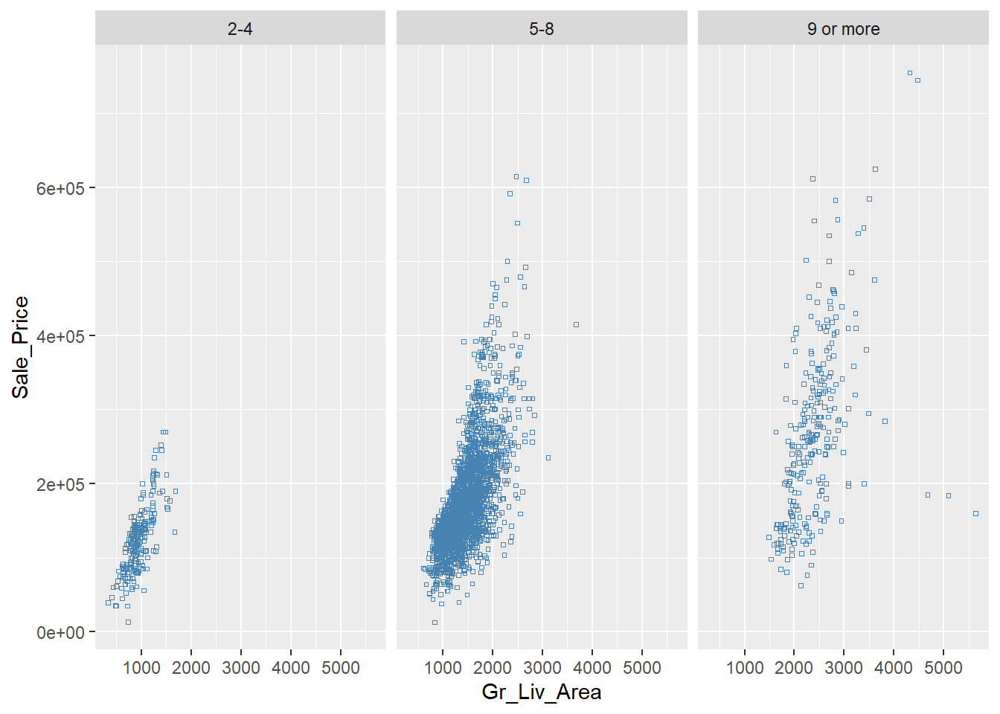


