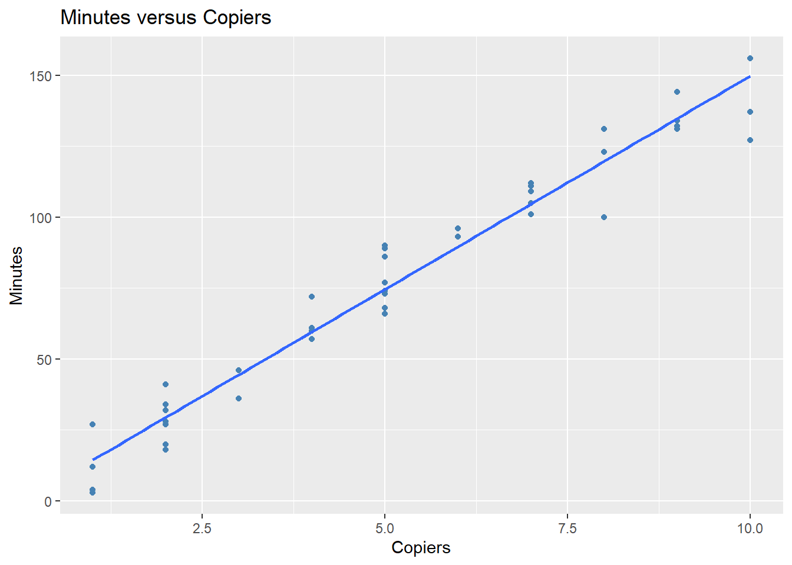

# PS 4 Solutions {-}

&nbsp;


## Problem 1 {-}

In this problem use functions from the `apply()` family of functions whenever you think you need `loops`.

&nbsp;

1. Create a function (name it `fun1`) that takes three arguments _n_, _miu_, and _sd_ (where _n_ is the number of randomly generated numbers, _miu_ is the mean value of the distribution that numbers come from, and _sd_ is the standard deviation of that distribution) and does the following:

   * First it generates _n_ random numbers from a normal distribution with mean = _miu_ and standard deviation = _sd_
   * Then it populates an empty matrix as follows: if _n_ is divisible by 2 but not by 3, it fills a matrix by row, having 2 rows and _n/2_ columns; if _n_ is divisible by 3 but not by 2, it fills a matrix by column, having 3 columns and _n/3_ rows; if _n_ is divisible by 2 and by 3, it fills a matrix by row, having 6 rows and _n/6_ columns; else it fills by row and has only one column
   * And returns a vector of mean values of each column in the matrix if none of the randomly generated numbers are negative; it returns a vector of median values of each row in the matrix if some of the randomly generated numbers are negative.
  
  
   Test your function with (_n_ = 50, _miu_ = 0.5, _sd_ = 2)
   

```r
set.seed(1)

fun1 <- function(n, miu, sd){
  
  data <- rnorm(n, mean=miu, sd=sd)
  
  if (n%%2==0 && n%%3!=0) {
    
    mat <- matrix(data, byrow=T, nrow=2)
    
  }
  
  else if (n%%3==0 && n%%2!=0) {
    
    mat <- matrix(data, byrow=F, ncol=3)
    
  }
  
  else if (n%%2==0 && n%%3==0) {
    
    mat <- matrix(data, byrow=T, nrow=6)
    
  }
  
  else {
    
    mat <- matrix(data, byrow=T, nrow=1)
    
  }
  
  print("The matrix is:")
  
  print(mat)
  
  if (all(mat>=0)) {
    
    result <- apply(mat, 2, mean)
    
  }
  
  else {
    
    result <- apply(mat, 1, median)
    
  }
  
  print("The funciton result is:")
  
  return (result)
}

fun1(n = 50, miu = 0.5, sd = 2)
#> [1] "The matrix is:"
#>            [,1]      [,2]      [,3]       [,4]     [,5]
#> [1,] -0.7529076 0.8672866 -1.171257  3.6905616 1.159016
#> [2,]  0.3877425 0.1884090 -2.441505 -0.4563001 1.335883
#>           [,6]      [,7]     [,8]      [,9]      [,10]
#> [1,] -1.140937 1.4748581 1.976649 1.6515627 -0.1107768
#> [2,]  3.217359 0.2944245 1.275343 0.3923899 -2.2541191
#>           [,11]      [,12]      [,13]     [,14]    [,15]
#> [1,]  3.5235623  1.2796865 -0.7424812 -3.929400 2.749862
#> [2,] -0.3299891 -0.2885799  0.3813732  2.700051 2.026351
#>          [,16]       [,17]    [,18]    [,19]      [,20]
#> [1,] 0.4101328  0.46761947 2.387672 2.142442  1.6878026
#> [2,] 0.1709528 -0.00672336 1.893927 1.613326 -0.8775114
#>           [,21]    [,22]    [,23]      [,24]    [,25]
#> [1,]  2.3379547 2.064273 0.649130 -3.4787034 1.739651
#> [2,] -0.9149903 1.229164 2.037066  0.2753076 2.262215
#> [1] "The funciton result is:"
#> [1] 1.2796865 0.3813732
```

&nbsp;

2. Create a function (name it `fun2`) that will take one argument _n_, which represents a number of trials in your simulation. Your function should simulate a process of rolling an unfair die with the following probability distribution: "1" - 0.1, "2" - 0.3, "3" - 0.2, "4" - 0.05, "5" - 0.3, "6" - 0.05. It should report the results of _n_ trials by returning the frequency table of the outcomes (for example, how many times you got "1", "2", and so on).

   Test your function with _n_ = 100.

   
"1” - 0.1, “2” - 0.3, “3” - 0.2, “4” - 0.05, “5” - 0.3, “6” - 0.05


```r
set.seed(1)

fun2 <- function(n) {
  
  trials <- sample(1:6, n, replace=T, prob=c(0.1, 0.3, 0.2, 0.05, 0.3, 0.05))
  
  return(table(trials))
  
}

fun2(100)
#> trials
#>  1  2  3  4  5  6 
#> 11 33 26  2 24  4
```
   
  &nbsp; 
  
3. Create a function (name it `fun3`) that will take one argument _n_, which represents a number of trials in your simulation. Your function should simulate a process of rolling two fair dice. It should report the results of _n_ trials by returning vectors of outcomes from both dice (name them `Die1` and `Die2`, respectively) and a vector that compares outcomes obtained from `Die1` and `Die2` (name it `comparison`). `comparison` vector should be created as follows: it should be created using `mapply()` function and should be a factor with three levels ("Die1 > Die2", "Die1 < Die2", "Die1 = Die2"). For instance, if the outcome of `Die1` is 5 and the outcome of `Die2` is 4, then it should produce "Die1 > Die2". 

   Test your function with _n_ = 30.
   

```r
set.seed(1)

fun3 <- function(n) {
  
  Die1 <- sample(1:6, n, replace=T)
  
  Die2 <- sample(1:6, n, replace=T)
  
  compare <- function(a, b) {
    
    if (a>b) {
      
      return (factor("Die1 > Die2"))
    }
    
    else if (a<b) {
      
      return (factor("Die1 < Die2"))
      
    }
    else {
      
      return (factor("Die1 = Die2"))
      
    }
    
  }
  
  comparison <- mapply(compare, Die1, Die2)
  
  return (data.frame(Die1, Die2, comparison))
  
}

fun3(30)
#>    Die1 Die2  comparison
#> 1     1    1 Die1 = Die2
#> 2     4    4 Die1 = Die2
#> 3     1    3 Die1 < Die2
#> 4     2    6 Die1 < Die2
#> 5     5    2 Die1 > Die2
#> 6     3    2 Die1 > Die2
#> 7     6    6 Die1 = Die2
#> 8     2    4 Die1 < Die2
#> 9     3    4 Die1 < Die2
#> 10    3    4 Die1 < Die2
#> 11    1    2 Die1 < Die2
#> 12    5    4 Die1 > Die2
#> 13    5    1 Die1 > Die2
#> 14    2    6 Die1 < Die2
#> 15    6    1 Die1 > Die2
#> 16    6    4 Die1 > Die2
#> 17    2    1 Die1 > Die2
#> 18    1    6 Die1 < Die2
#> 19    5    2 Die1 > Die2
#> 20    5    3 Die1 > Die2
#> 21    1    2 Die1 < Die2
#> 22    1    6 Die1 < Die2
#> 23    6    6 Die1 = Die2
#> 24    5    2 Die1 > Die2
#> 25    5    5 Die1 = Die2
#> 26    2    2 Die1 = Die2
#> 27    2    6 Die1 < Die2
#> 28    6    6 Die1 = Die2
#> 29    1    6 Die1 < Die2
#> 30    4    1 Die1 > Die2
```

  &nbsp;
  
  
## Problem 2 {-}


```r

data <- read.csv("ames_housing.csv", header = T, stringsAsFactors = TRUE)

library(tidyverse)
#> ── Attaching packages ─────────────────── tidyverse 1.3.2 ──
#> ✔ ggplot2 3.3.6      ✔ purrr   0.3.5 
#> ✔ tibble  3.1.8      ✔ dplyr   1.0.10
#> ✔ tidyr   1.2.1      ✔ stringr 1.4.1 
#> ✔ readr   2.1.3      ✔ forcats 0.5.2 
#> ── Conflicts ────────────────────── tidyverse_conflicts() ──
#> ✖ dplyr::filter() masks stats::filter()
#> ✖ dplyr::lag()    masks stats::lag()
```

1. John is a new real estate agent in the area. A friend of his, who worked in this area before, told him that the average price for houses sold in the area is \$210,000. John feels a bit skeptical about this claim and wants to test it. Perform an appropriate statistical procedure to test this claim. Use the $\alpha = 0.05$ significance level to make a conclusion. State the null and alternative hypotheses. What is the test statistic? What are the degrees of freedom? What is the p-value? What did you conclude?

\begin{align}
& H_{0}: \textrm{The average price for houses sold in the area equals \$210,000.} \\
& H_{1}: \textrm{The average price for houses sold in the area } \neq \textrm{ \$210,000.}
\end{align}

The test statistics is $t = \frac{\bar{x}-210000}{s/sqrt{n}} \sim t(n-1)$, where $n$ is the sample size:


```r
length(data$Sale_Price)
#> [1] 2925
```

The degrees of freedom equals $n-1 = 2924$.


```r
t.test(x=data$Sale_Price,
       alternative = "two.sided",
       mu = 210000,
       conf.level = 0.95)
#> 
#> 	One Sample t-test
#> 
#> data:  data$Sale_Price
#> t = -19.783, df = 2924, p-value < 2.2e-16
#> alternative hypothesis: true mean is not equal to 210000
#> 95 percent confidence interval:
#>  177878.2 183671.5
#> sample estimates:
#> mean of x 
#>  180774.9
```

Based on the t-test, the $p$-values is $<2.2\times 10^{-16}$. Thus, we reject the null hypothesis and conclude that "The average house price in the area is different from \$210,000".

&nbsp;

2. John has been in this industry for quite some time. Over the course of past 10 years, he's noticed that a type of roof that houses have can somehow define the fence quality. In other words, he thinks that these two features (`Roof_Style` and `Fence` variables in the dataset) are somehow related. Test his hypothesis based on the sample data at the  $\alpha = 0.01$ significance level. State the null and alternative hypotheses. What is the test statistic? What are the degrees of freedom? What is the p-value? What did you conclude?


\begin{align}
& H_{0}: \textrm{"Roof Style" and "Fence" are independent. The observed difference is due to chance.} \\
& H_{1}: \textrm{"Roof Style" and "Fence" are not independent. The observed difference is not due to chance.}
\end{align}

The test statistics is
$$
\chi^{2} = \sum_{i=1}^{k}\frac{(\textrm{observed}_{i} - \textrm{exptected}_{i})^{2}}{\textrm{expected}_{i}}.
$$

The observed values are cell values in the table:


```r
data %>%
  
  select(Roof_Style, Fence) %>%
  
  table() %>%
  
  addmargins()
#>           Fence
#> Roof_Style Good_Privacy Good_Wood Minimum_Privacy
#>    Flat               1         1               0
#>    Gable             96        92             263
#>    Gambrel            2         2               7
#>    Hip               19        16              59
#>    Mansard            0         1               1
#>    Sum              118       112             330
#>           Fence
#> Roof_Style Minimum_Wood_Wire No_Fence  Sum
#>    Flat                    0       18   20
#>    Gable                   8     1862 2321
#>    Gambrel                 0       11   22
#>    Hip                     4      453  551
#>    Mansard                 0        9   11
#>    Sum                    12     2353 2925
```

Suppose "Roof\_Style" and "Fence" are independent. The expected value of "Good\_Privacy" fence and "Flat" roof style should be:

$$
118\times\frac{20}{2925} \approx 0.8068.
$$

The degrees of freedom is:
$$
(\textrm{number of rows} - 1)(\textrm{number of columns}-1) = (5-1)\times(5-1) = 16.
$$


```r
chisq.test(data$Roof_Style, data$Fence)
#> 
#> 	Pearson's Chi-squared test
#> 
#> data:  data$Roof_Style and data$Fence
#> X-squared = 21.698, df = 16, p-value = 0.1532
```

The $p$-value is $0.1522$. It is larger than the significance level $0.1$. We fail to reject the null hypothesis. We conclude that the roof style and the fence are independent.

&nbsp;

3. John is specifically interested in two neighborhoods: `North_Ames` and `College_Creek`. He did some research prior his arrival and he thinks that on average houses in the `College_Creek` neighborhood are \$50,000 more expensive than the houses sold in the `North_Ames` neighborhood. Test his hypothesis at the $\alpha = 0.02$ significance level. State the null and alternative hypotheses. What is the test statistic? What are the degrees of freedom? What is the p-value? What did you conclude?

Let $\mu_{\textrm{collegeCreek}}$ be the mean housing price in "College\_Creek" and $\mu_{\textrm{northAmes}}$ be the mean housing price in "North\_Ames". Then the hypotheses are:

\begin{align*}
& H_{0}: \mu_{\textrm{collegeCreek}}-\mu_{\textrm{northAmes}}  =  \textrm{\$50,000}. \\
& H_{1}: \mu_{\textrm{collegeCreek}}-\mu_{\textrm{northAmes}} > \textrm{\$50,000}.
\end{align*}

Perform Levene's test to test if the variances of housing price in "College\_Creek" and that in "North\_Ames" are homogeneous.


```r
library(car)
data1 <- data %>% filter(Neighborhood %in% c("College_Creek", "North_Ames"))
leveneTest(Sale_Price ~ Neighborhood, data = data1)
#> Levene's Test for Homogeneity of Variance (center = median)
#>        Df F value    Pr(>F)    
#> group   1  63.816 5.539e-15 ***
#>       708                      
#> ---
#> Signif. codes:  
#> 0 '***' 0.001 '**' 0.01 '*' 0.05 '.' 0.1 ' ' 1
```

$p$-value from Levene's test is pretty small, indicating the variances of the housing price in "College\_Creek" and that in "North\_Ames" are different. 

The  test statistics is 
$$
t = \frac{\bar{x}_{1}-\bar{x}_{2}-50000}{\sqrt{s_{1}^{2}/n_{1}+s^{2}_{2}/n_{2}}} \sim t(n_{1}+n_{2}-2).
$$

The degrees of freedom is:

```r
nrow(data1)-2
#> [1] 708
```


```r
collegeCreek <- data1 %>%
  
         filter(Neighborhood == "College_Creek") %>%
          
         select(Sale_Price)

northAmes <- data1 %>%
  
         filter(Neighborhood == "North_Ames") %>%
          
         select(Sale_Price)

t.test(x = collegeCreek,
       
       y = northAmes,
       
       alternative = "greater",
       
       var.equal = FALSE,
       
       mu = 50000,
       
       conf.level = 0.98)
#> 
#> 	Welch Two Sample t-test
#> 
#> data:  collegeCreek and northAmes
#> t = 1.8394, df = 378.66, p-value = 0.03332
#> alternative hypothesis: true difference in means is greater than 50000
#> 98 percent confidence interval:
#>  49192.59      Inf
#> sample estimates:
#> mean of x mean of y 
#>  201803.4  145097.3
```

The $p$-value from the two-sample t test is $0.033$, which is greater than the significance level $0.02$. We fail to reject $H_{0}$. We conclude that the average housing price in "College\_Creek" is not \$50,000 more expensive than that in "North\_Ames".


&nbsp;

4. John decides to split all homes in the dataset into the following three groups based on the total number of rooms above the ground: `"2-4"`, `"5-8"`, and `"9 or more"`. He believes that 10\% of homes belong to the `"2-4"` category, 85\% belong to the `"5-8"` category, and the remaining 5\% belong to the `"9 or more"` category. Test his hypothesis using the appropriate statistical procedure at the $\alpha = 0.01$ significance level. State the null and alternative hypotheses. What is the test statistic? What are the degrees of freedom? What is the p-value? What did you conclude?

   Before you perform the test, you need to add a new variable to the dataset (name it `Rooms`) using the splitting rule proposed by John. In other words, you need to create a factor variable with 3 levels by converting the `TotRms_AbvGrd` variable. (Hint: you might want to check out the `case_when()` function from `dpyr` package).


```r
categorize <- function(x) {
  case_when(x<=4 & x>=2 ~ "2-4",
            x<=8 & x>=5 ~ "5-8",
            x>=9 ~ "9 or more") %>%
  as.factor()
}
data <- data %>%
  mutate(Rooms = categorize(TotRms_AbvGrd))
```

\begin{align*}
& H_{0}: \textrm{The distribution of the number of rooms above the ground is:} \\
& \textrm{"2-4" accounts for 10%, "5-8" accounts for 85% and "9 or more" accounts for 5%.} \\
& H_{1}: \textrm{The distribution of the number of rooms above the ground is NOT: }\\
& \textrm{"2-4" accounts for 10%, "5-8" accounts for 85% and "9 or more" accounts for 5%.}
\end{align*}

The test statistics is
$$
\chi^{2} = \sum_{i=1}^{k}\frac{(\textrm{observed}_{i} - \textrm{exptected}_{i})^{2}}{\textrm{expected}_{i}}.
$$
The degrees of freedom is $3-1 = 2$.


```r
data %>% 
  select(Rooms) %>%
  table()
#> Rooms
#>       2-4       5-8 9 or more 
#>       228      2424       273
```


```r
chisq.test(x=c(228, 2424, 273), p=c(0.1, 0.85, 0.05))
#> 
#> 	Chi-squared test for given probabilities
#> 
#> data:  c(228, 2424, 273)
#> X-squared = 125.63, df = 2, p-value < 2.2e-16
```

The $p$-value is $<2.2\times 10^{-16}$, smaller than the significance level $0.01$. We reject the null hypothesis and conclude that the distribution of the grades of the number of rooms above ground is not: "2-4" ~ 10\%, "5-8" ~ 85\% and "9 or more" ~ 5\%.


&nbsp;


## Problem 3 {-}


1. Fit the least squares linear regression model. 


```r

data2 <- read.table(file = "copier_maintenance.txt", header = T, sep = "")


model <- lm(Minutes ~ Copiers, data = data2)
```

&nbsp;

2. Display the summary of the model obtained in part 1.


```r

summary(model)
#> 
#> Call:
#> lm(formula = Minutes ~ Copiers, data = data2)
#> 
#> Residuals:
#>      Min       1Q   Median       3Q      Max 
#> -22.7723  -3.7371   0.3334   6.3334  15.4039 
#> 
#> Coefficients:
#>             Estimate Std. Error t value Pr(>|t|)    
#> (Intercept)  -0.5802     2.8039  -0.207    0.837    
#> Copiers      15.0352     0.4831  31.123   <2e-16 ***
#> ---
#> Signif. codes:  
#> 0 '***' 0.001 '**' 0.01 '*' 0.05 '.' 0.1 ' ' 1
#> 
#> Residual standard error: 8.914 on 43 degrees of freedom
#> Multiple R-squared:  0.9575,	Adjusted R-squared:  0.9565 
#> F-statistic: 968.7 on 1 and 43 DF,  p-value: < 2.2e-16
```

&nbsp;

3. Plot the data and overlay the linear regression function you obtained in part 1.


```r

library(tidyverse)

  ggplot(data = data2, aes(x = Copiers, y = Minutes)) + 
  
  geom_point(color = "steelblue") +
  
  labs(title = "Minutes versus Copiers",
       
       x = "Copiers",
       
       y = "Minutes") +
  
  geom_smooth(method = 'lm', se = FALSE)
#> `geom_smooth()` using formula 'y ~ x'
```



&nbsp;

4. Obtain a point estimate of the mean service time when 7 copiers are serviced. 


```r

predict(model, data.frame(Copiers = 7))
#>        1 
#> 104.6666
```


&nbsp;

5. Obtain a 95% confidence interval for the slope.


```r

confint(model, "Copiers", level = 0.95)
#>            2.5 %   97.5 %
#> Copiers 14.06101 16.00949
```

&nbsp;

6. Obtain a 95% confidence interval for the mean service time when 7 copiers are serviced.


```r

predict(model, data.frame(Copiers = 7), interval = "confidence", level = 0.95)
#>        fit      lwr      upr
#> 1 104.6666 101.4159 107.9173
```

&nbsp;

7. Obtain a 95% prediction interval for the mean service time when 7 copiers are serviced.


```r

predict(model, data.frame(Copiers = 7), interval = "prediction", level = 0.95)
#>        fit      lwr      upr
#> 1 104.6666 86.39922 122.9339
```
