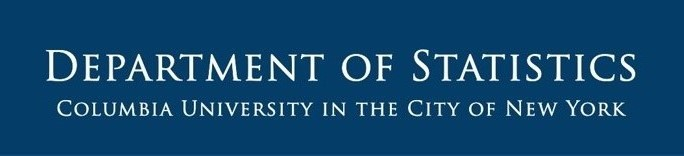

--- 
title: "Summer Coding Bootcamp"
author: "Alex Pijyan"
date: "`r Sys.Date()`"
site: bookdown::bookdown_site
documentclass: book
bibliography:
- book.bib
- packages.bib
github-repo: ''
url: ''
description: |
  Summer R Bootcamp for MA students
biblio-style: apalike
csl: "chicago-fullnote-bibliography.csl"
---


# Welcome {-}

&nbsp;

```{r, echo=FALSE, out.width="100%"}

```

&nbsp;

Welcome to **_Summer Coding Bootcamp_**. This website contains comprehensive notes and tutorials on topics covered in the **R** portion of the bootcamp.

&nbsp;

**Introduction**: The Summer R/Python Bootcamp is designed to equip incoming MA students with a strong foundation in R and Python, two of the most widely used and versatile programming languages in statistics, data science, and quantitative research. As computational proficiency has become an essential component of graduate training and professional practice, this bootcamp aims to ensure that students begin the MA program with the technical skills, confidence, and preparation needed to succeed in a rigorous and increasingly data-driven curriculum.

The bootcamp is intended to help students develop a solid understanding of core programming concepts, strengthen their coding abilities, and gain practical experience applying both R and Python to data manipulation, visualization, and problem solving.

Over the course of four weeks, students will be introduced to both foundational and more advanced aspects of programming in R and Python. The curriculum will guide them from basic programming principles to essential techniques in data analysis and statistical computing, exposing them to a broad range of topics through structured lecture notes, worked examples, and hands-on exercises. 


&nbsp;

**Objectives**: Students who successfully complete the summer bootcamp will be able to:

* Develop a solid foundation in the basic programming concepts and syntax of R and Python. 
* Import, manage, and work with data in a variety of formats and structures. 
* In R, clean, transform, and manipulate data effectively for analysis. For Python, these topics will be covered more extensively in the regular Fall course, STAT GR5206.
* In R, use appropriate data wrangling techniques to organize and prepare datasets for downstream tasks. For Python, these topics will be covered more extensively in the regular Fall course, STAT GR5206.
* Create clear and informative visualizations to explore and summarize data. 
* Apply basic exploratory data analysis methods to identify patterns, trends, and potential issues in datasets. 
* Reinforce and apply familiar statistical concepts through computational examples and data-based exercises. 
* Communicate analytical findings clearly through well-structured code, visual displays, and concise written interpretation.


&nbsp;

Below are topics covered in the **R** portion of the bootcamp:

**Week 1: Base R**

* Data Types
* Data Structures
* Conditional Statements (Control Structures) &amp; Loops
* Functions
* Rmarkdown Files

**Week 2: Functional Programming and Tidyverse packages**

* Functional Programming
* Dplyr Package
* Tidyr Package
* ggplot2 Package


```{r include=FALSE}
# automatically create a bib database for R packages
knitr::write_bib(c(
  .packages(), 'bookdown', 'knitr', 'rmarkdown'
), 'packages.bib')
```